# 🍕 YemekSiparisMete: Gastronomi ve Teknolojinin Kusursuz Senfonisi

## 📂 Mimari Yapı

```bash
yemeksiparismete/
├── 🌐 .Server/        # Core API: Business Logic & SignalR Hubs
├── 💻 .client/        # Web App: React 19 Design System
├── 📱 _mobile/        # Mobile App: Flutter Real-time Engine
├── 🗄️ sqlserver/YemekSiparisDb_Yedek.sql    # Veritabanı Yedeği (Hızlı Kurulum İçin)
├── 📄 README.md       # Proje Dokümantasyonu
├── 📄 screenshot/README.md  #Projenin Hem Web Hem Mobil Üzerinden Çalıştığına Dair Kanıtlar
└── 🧪 AutoSeeder/     # Mock Data: Akıllı Test Veri Üreticisi
```
<div align="center" style="width: 100%; box-sizing: border-box; overflow-x: hidden;">
<br>
<div align="left" style="background-color: #FDFBF7; padding: 30px; border-radius: 15px; border: 1px solid #EAE8E1; font-family: 'Segoe UI', Tahoma, Geneva, Verdana, sans-serif; width: 100%; box-sizing: border-box;">
  
  <h2 style="color: #2C3E50; margin-top: 0; border-bottom: 2px solid #E2E0D6; padding-bottom: 10px; word-wrap: break-word;">
    🏛️ 1. Mimari Şaheser: Sistem Topolojisi
  </h2>
  <p style="color: #7F8C8D; font-size: 15px; margin-bottom: 40px; word-wrap: break-word;">
    Sistem, yüksek erişilebilirlik ve sürdürülebilirlik için <b>N-Tier (Çok Katmanlı)</b> mimari standartlarında kurgulanmıştır.
  </p>
  <div style="width: 100%; overflow-x: auto; padding-bottom: 15px; text-align: center; box-sizing: border-box;">
    <table width="100%" border="0" cellpadding="0" cellspacing="0" align="center" style="border: none; background: transparent; margin: auto; width: 100%; min-width: 100%;">
          <tr>
        <td align="center" style="width: 40%;">
          <div style="background: #FFFFFF; border: 2px solid #3498DB; padding: 15px 25px; border-radius: 8px; box-shadow: 0 4px 6px rgba(0,0,0,0.1);">
            <span style="font-size: 20px;">📱</span><br><b style="color: #2980B9;">Flutter Mobile</b>
          </div>
        </td>
        <td align="center" style="width: 20%;"></td>
        <td align="center" style="width: 40%;">
          <div style="background: #FFFFFF; border: 2px solid #3498DB; padding: 15px 25px; border-radius: 8px; box-shadow: 0 4px 6px rgba(0,0,0,0.1);">
            <span style="font-size: 20px;">💻</span><br><b style="color: #2980B9;">React 19 Web</b>
          </div>
        </td>
      </tr>
          <tr>
        <td align="center" style="padding: 10px 0;">
          <small style="color: #95A5A6;">IPv4 Access</small><br>
          <span style="font-size: 24px; color: #BDC3C7;">↓</span>
        </td>
        <td></td>
        <td align="center" style="padding: 10px 0;">
          <small style="color: #95A5A6;">SignalR Realtime</small><br>
          <span style="font-size: 24px; color: #BDC3C7;">↓</span>
        </td>
      </tr>
          <tr>
        <td colspan="3" align="center">
          <div style="background: #2C3E50; border: 2px solid #1A252F; padding: 20px 50px; border-radius: 10px; color: #ECF0F1; box-shadow: 0 6px 12px rgba(0,0,0,0.2); width: 100%; box-sizing: border-box;">
            <span style="font-size: 22px;">⚙️</span><br><b>.NET 8 CORE API</b>
            <br><small style="color: #BDC3C7; font-weight: normal;">Central Orchestrator</small>
          </div>
        </td>
      </tr>
          <tr>
        <td align="center" style="padding: 10px 0;">
          <span style="font-size: 24px; color: #BDC3C7;">↓</span><br>
          <small style="color: #95A5A6;">Persistence</small>
        </td>
        <td></td>
        <td align="center" style="padding: 10px 0;">
          <span style="font-size: 24px; color: #BDC3C7;">↓</span><br>
          <small style="color: #95A5A6;">Push Notify</small>
        </td>
      </tr>
          <tr>
        <td align="center">
          <div style="background: #FFFFFF; border: 2px solid #7F8C8D; padding: 15px 25px; border-radius: 10px;">
            <span style="font-size: 20px;">🗄️</span><br><b style="color: #34495E;">SQL SERVER</b>
          </div>
        </td>
        <td></td>
        <td align="center">
          <div style="background: #FFFFFF; border: 2px solid #E67E22; padding: 15px 25px; border-radius: 8px;">
            <span style="font-size: 20px;">📡</span><br><b style="color: #D35400;">SignalR Hub</b>
          </div>
        </td>
      </tr>
    </table>
  </div>
</div>
<br>
<div align="left" style="background-color: #FDFBF7; padding: 30px; border-radius: 12px; border: 1px solid #EAE8E1; font-family: sans-serif; width: 100%; box-sizing: border-box;">
    <h2 style="color: #4A4A4A; display: flex; align-items: center; gap: 10px; margin-top: 0; word-wrap: break-word;">
    🛡️ 2. Backend Mühendisliği: Verimlilik ve Ölçeklenebilirlik
  </h2>
    <p style="color: #666; font-size: 15px; line-height: 1.6; margin-bottom: 20px; word-wrap: break-word;">
    Sistemin kalbi olan backend tarafında, kurumsal düzeyde (enterprise-grade) teknolojiler kullanılarak sarsılmaz bir iş mantığı katmanı oluşturulmuştur.
  </p>
  <div style="width: 100%; overflow-x: auto; box-sizing: border-box;">
    <table width="100%" style="width: 100%; min-width: 100%; border-collapse: collapse; background-color: #FFFFFF; border-radius: 8px; overflow: hidden; box-shadow: 0 2px 5px rgba(0,0,0,0.05); box-sizing: border-box;">
      <thead>
        <tr style="background-color: #E2E0D6; border-bottom: 2px solid #C5C3B6;">
          <th align="left" style="padding: 16px; color: #4A4A4A; font-size: 14px; width: 25%;">Teknoloji</th>
          <th align="left" style="padding: 16px; color: #4A4A4A; font-size: 14px; width: 15%;">Versiyon</th>
          <th align="left" style="padding: 16px; color: #4A4A4A; font-size: 14px; width: 60%;">Görev & Stratejik Avantaj</th>
        </tr>
      </thead>
      <tbody>
        <tr style="border-bottom: 1px solid #EAE8E1;">
          <td style="padding: 16px; font-size: 14px;"><b>Microsoft .NET Core</b></td>
          <td style="padding: 16px; font-size: 14px; color: #666;">8.0</td>
          <td style="padding: 16px; font-size: 14px; color: #333;">Yüksek işlem kapasiteli, düşük gecikme süreli ana motor.</td>
        </tr>
        <tr style="border-bottom: 1px solid #EAE8E1;">
          <td style="padding: 16px; font-size: 14px;"><b>Entity Framework Core</b></td>
          <td style="padding: 16px; font-size: 14px; color: #666;">8.0</td>
          <td style="padding: 16px; font-size: 14px; color: #333;">Veritabanı yönetiminde nesne-tabanlı (ORM) esneklik.</td>
        </tr>
        <tr style="border-bottom: 1px solid #EAE8E1;">
          <td style="padding: 16px; font-size: 14px;"><b>SQL Server</b></td>
          <td style="padding: 16px; font-size: 14px; color: #666;">Enterprise</td>
          <td style="padding: 16px; font-size: 14px; color: #333;">ACID prensiplerine tam uyumlu, güvenilir veri depolama.</td>
        </tr>
        <tr style="border-bottom: 1px solid #EAE8E1;">
          <td style="padding: 16px; font-size: 14px;"><b>SignalR</b></td>
          <td style="padding: 16px; font-size: 14px; color: #666;">Real-Time</td>
          <td style="padding: 16px; font-size: 14px; color: #333;">Mutfak ve müşteri arasında kesintisiz canlı veri akışı.</td>
        </tr>
        <tr>
          <td style="padding: 16px; font-size: 14px;"><b>ASP.NET Identity</b></td>
          <td style="padding: 16px; font-size: 14px; color: #666;">JWT</td>
          <td style="padding: 16px; font-size: 14px; color: #333;">Role-based (Rol tabanlı) kriptografik güvenlik sistemi.</td>
        </tr>
      </tbody>
    </table>
  </div>
</div>
<br>
<div align="left" style="background-color: #FDFBF7; padding: 30px; border-radius: 12px; border: 1px solid #EAE8E1; font-family: sans-serif; width: 100%; box-sizing: border-box;">
    <h2 style="color: #4A4A4A; display: flex; align-items: center; gap: 10px; margin-top: 0; word-wrap: break-word;">
    🗄️ 3. Veritabanı ve Veri Yönetimi (SQL Server)
  </h2>
    <p style="color: #666; font-size: 15px; line-height: 1.6; margin-bottom: 20px; word-wrap: break-word;">
    Projenin veri ambarı, <b>Microsoft SQL Server</b> üzerinde optimize edilmiştir. Veri bütünlüğü (integrity) ve ilişkisel modelleme (relational mapping) en üst seviyededir.
  </p>
  <div style="width: 100%; overflow-x: auto; box-sizing: border-box;">
    <table width="100%" style="width: 100%; min-width: 100%; border-collapse: collapse; background-color: #FFFFFF; border-radius: 8px; overflow: hidden; box-shadow: 0 2px 5px rgba(0,0,0,0.05); box-sizing: border-box;">
      <thead>
        <tr style="background-color: #E2E0D6; border-bottom: 2px solid #C5C3B6;">
          <th align="left" style="padding: 16px; color: #4A4A4A; font-size: 14px; width: 30%;">Mimari Özellik</th>
          <th align="left" style="padding: 16px; color: #4A4A4A; font-size: 14px; width: 70%;">Teknik Detay & Operasyon</th>
        </tr>
      </thead>
      <tbody>
        <tr style="border-bottom: 1px solid #EAE8E1;">
          <td style="padding: 16px; font-size: 14px;"><b>İlişkisel Mimari</b></td>
          <td style="padding: 16px; font-size: 14px; color: #333;">Müşteriler, Restoranlar, Ürünler, Siparişler ve Kuryeler arasındaki karmaşık bağlar, verimli <code>Join</code> operasyonları ve indeksleme stratejileriyle yönetilir.</td>
        </tr>
        <tr style="border-bottom: 1px solid #EAE8E1;">
          <td style="padding: 16px; font-size: 14px;"><b>Veri Güvenliği</b></td>
          <td style="padding: 16px; font-size: 14px; color: #333;">Tüm hassas veriler, uygulama katmanında normalize edildikten sonra SQL Server'ın güvenli havuzuna aktarılır.</td>
        </tr>
        <tr>
          <td style="padding: 16px; font-size: 14px;"><b>Hızlı Kurulum</b></td>
          <td style="padding: 16px; font-size: 14px; color: #333;">Proje içerisinde bulunan <code>YemekSiparisDb_Yedek.sql</code> dosyası ile saniyeler içinde tüm şema ve test verileri ayağa kaldırılabilir.</td>
        </tr>
      </tbody>
    </table>
  </div>
</div>
<br>
<div align="left" style="background-color: #FDFBF7; padding: 30px; border-radius: 12px; border: 1px solid #EAE8E1; font-family: sans-serif; width: 100%; box-sizing: border-box;">
    <h2 style="color: #4A4A4A; display: flex; align-items: center; gap: 10px; margin-top: 0; word-wrap: break-word;">
    🌐 4. Ağ Topolojisi ve IPv4 Erişim Dinamikleri
  </h2>
    <p style="color: #666; font-size: 15px; line-height: 1.6; margin-bottom: 20px; word-wrap: break-word;">
    Çapraz platform (Cross-platform) haberleşmesi, sistemin en güçlü yanlarından biridir. Mobil ve Web istemcilerinin merkezi sunucuyla sorunsuz etkileşimi için özel bir ağ yapılandırması uygulanmıştır.
    </p>
  <div style="width: 100%; overflow-x: auto; box-sizing: border-box;">
    <table width="100%" style="width: 100%; min-width: 100%; border-collapse: collapse; background-color: #FFFFFF; border-radius: 8px; overflow: hidden; box-shadow: 0 2px 5px rgba(0,0,0,0.05); box-sizing: border-box;">
      <thead>
        <tr style="background-color: #E2E0D6; border-bottom: 2px solid #C5C3B6;">
          <th align="left" style="padding: 16px; color: #4A4A4A; font-size: 14px; width: 40%;">Konfigürasyon Parametresi</th>
          <th align="left" style="padding: 16px; color: #4A4A4A; font-size: 14px; width: 60%;">Tanımlanan Değer / Protokol</th>
        </tr>
      </thead>
      <tbody>
        <tr style="border-bottom: 1px solid #EAE8E1;">
          <td style="padding: 16px; font-size: 14px;"><b>Sunucu IPv4 Adresi</b></td>
          <td style="padding: 16px; font-size: 14px; color: #D32F2F; font-family: monospace;"><b>10.22.107.60</b></td>
        </tr>
        <tr style="border-bottom: 1px solid #EAE8E1;">
          <td style="padding: 16px; font-size: 14px;"><b>Dinleme Portu</b></td>
          <td style="padding: 16px; font-size: 14px; color: #333;">5101 (HTTP & TCP)</td>
        </tr>
        <tr style="border-bottom: 1px solid #EAE8E1;">
          <td style="padding: 16px; font-size: 14px;"><b>Haberleşme Protokolü</b></td>
          <td style="padding: 16px; font-size: 14px; color: #333;">HTTP/REST & WebSockets (SignalR)</td>
        </tr>
        <tr>
          <td style="padding: 16px; font-size: 14px;"><b>Erişim Kapsamı</b></td>
          <td style="padding: 16px; font-size: 14px; color: #333;">Physical Device Testing (Yerel Ağ Köprüsü)</td>
        </tr>
      </tbody>
    </table>
  </div>
    <p style="color: #888; font-size: 13px; margin-top: 15px; font-style: italic; word-wrap: break-word;">
    * Bu yapılandırma, <b>localhost</b> sınırlarını aşarak gerçek dünya ağ senaryolarında projenin kesintisiz çalışmasını garanti altına alır.
  </p>
</div>
<br>
<div align="left" style="background-color: #FDFBF7; padding: 30px; border-radius: 12px; border: 1px solid #EAE8E1; font-family: sans-serif; width: 100%; box-sizing: border-box;">
    <h2 style="color: #4A4A4A; display: flex; align-items: center; gap: 10px; margin-top: 0; word-wrap: break-word;">
    🎨 5. Web Frontend: Estetik ve Fonksiyonelliğin Senfonisi
  </h2>
    <p style="color: #666; font-size: 15px; line-height: 1.6; margin-bottom: 20px; word-wrap: break-word;">
    Web arayüzü, <b>React 19</b> ve modern CSS teknikleriyle tasarlanmış, kullanıcı deneyimini (UX) odağına alan bir görsel şölen sunar.
  </p>
  <div style="width: 100%; overflow-x: auto; box-sizing: border-box;">
    <table width="100%" style="width: 100%; min-width: 100%; border-collapse: collapse; background-color: #FFFFFF; border-radius: 8px; overflow: hidden; box-shadow: 0 2px 5px rgba(0,0,0,0.05); box-sizing: border-box;">
      <thead>
        <tr style="background-color: #E2E0D6; border-bottom: 2px solid #C5C3B6;">
          <th align="left" style="padding: 16px; color: #4A4A4A; font-size: 14px; width: 25%;">Bileşen</th>
          <th align="left" style="padding: 16px; color: #4A4A4A; font-size: 14px; width: 25%;">Teknolojik Derinlik</th>
          <th align="left" style="padding: 16px; color: #4A4A4A; font-size: 14px; width: 50%;">Stratejik Avantaj</th>
        </tr>
      </thead>
      <tbody>
        <tr style="border-bottom: 1px solid #EAE8E1;">
          <td style="padding: 16px; font-size: 14px;"><b>React 19</b></td>
          <td style="padding: 16px; font-size: 14px; color: #666;">Latest Release</td>
          <td style="padding: 16px; font-size: 14px; color: #333;">Modern rendering ve üstün component hiyerarşisi.</td>
        </tr>
        <tr style="border-bottom: 1px solid #EAE8E1;">
          <td style="padding: 16px; font-size: 14px;"><b>Vite Engine</b></td>
          <td style="padding: 16px; font-size: 14px; color: #666;">Ultra Fast</td>
          <td style="padding: 16px; font-size: 14px; color: #333;">Saniyeler içinde yüklenen sayfalar ve optimize bundle.</td>
        </tr>
        <tr style="border-bottom: 1px solid #EAE8E1;">
          <td style="padding: 16px; font-size: 14px;"><b>TypeScript</b></td>
          <td style="padding: 16px; font-size: 14px; color: #666;">Type-Safe</td>
          <td style="padding: 16px; font-size: 14px; color: #333;">Çalışma zamanı hatalarını sıfıra indiren güçlü kod yapısı.</td>
        </tr>
        <tr>
          <td style="padding: 16px; font-size: 14px;"><b>Framer Motion</b></td>
          <td style="padding: 16px; font-size: 14px; color: #666;">3D & Glass</td>
          <td style="padding: 16px; font-size: 14px; color: #333;">3D hover efektleri ve premium cam efekti (Glassmorphism).</td>
        </tr>
      </tbody>
    </table>
  </div>
</div>
<br>
<div align="left" style="background-color: #FDFBF7; padding: 30px; border-radius: 12px; border: 1px solid #EAE8E1; font-family: sans-serif; width: 100%; box-sizing: border-box;">
    <h2 style="color: #4A4A4A; display: flex; align-items: center; gap: 10px; margin-top: 0; word-wrap: break-word;">
    📲 6. Mobil Teknoloji: Avucunuzdaki Hız ve Zarafet
  </h2>
    <p style="color: #666; font-size: 15px; line-height: 1.6; margin-bottom: 20px; word-wrap: break-word;">
    Flutter ile inşa edilen mobil uygulama, native performansını şık bir tasarım diliyle birleştirir.
  </p>
  <div style="width: 100%; overflow-x: auto; box-sizing: border-box;">
    <table width="100%" style="width: 100%; min-width: 100%; border-collapse: collapse; background-color: #FFFFFF; border-radius: 8px; overflow: hidden; box-shadow: 0 2px 5px rgba(0,0,0,0.05); box-sizing: border-box;">
      <thead>
        <tr style="background-color: #E2E0D6; border-bottom: 2px solid #C5C3B6;">
          <th align="left" style="padding: 16px; color: #4A4A4A; font-size: 14px; width: 25%;">Özellik</th>
          <th align="left" style="padding: 16px; color: #4A4A4A; font-size: 14px; width: 25%;">Detay</th>
          <th align="left" style="padding: 16px; color: #4A4A4A; font-size: 14px; width: 50%;">Kullanıcı Deneyimi (UX)</th>
        </tr>
      </thead>
      <tbody>
        <tr style="border-bottom: 1px solid #EAE8E1;">
          <td style="padding: 16px; font-size: 14px;"><b>Flutter / Dart</b></td>
          <td style="padding: 16px; font-size: 14px; color: #666;">Reaktif Mimari</td>
          <td style="padding: 16px; font-size: 14px; color: #333;">Takılmayan, 60 FPS akıcılığında ekran geçişleri.</td>
        </tr>
        <tr style="border-bottom: 1px solid #EAE8E1;">
          <td style="padding: 16px; font-size: 14px;"><b>Provider</b></td>
          <td style="padding: 16px; font-size: 14px; color: #666;">State Management</td>
          <td style="padding: 16px; font-size: 14px; color: #333;">Verilerin cihaz hafızasında anlık ve tutarlı yönetimi.</td>
        </tr>
        <tr style="border-bottom: 1px solid #EAE8E1;">
          <td style="padding: 16px; font-size: 14px;"><b>Material 3</b></td>
          <td style="padding: 16px; font-size: 14px; color: #666;">Tasarım Dili</td>
          <td style="padding: 16px; font-size: 14px; color: #333;">Modern, temiz ve göz yormayan profesyonel arayüz.</td>
        </tr>
        <tr>
          <td style="padding: 16px; font-size: 14px;"><b>API Sync</b></td>
          <td style="padding: 16px; font-size: 14px; color: #666;">Optimized HTTP</td>
          <td style="padding: 16px; font-size: 14px; color: #333;">Düşük internet hızına sahip ortamlarda bile kararlı veri alışverişi.</td>
        </tr>
      </tbody>
    </table>
  </div>
</div>
<br>
<div align="left" style="background-color: #FDFBF7; padding: 30px; border-radius: 12px; border: 1px solid #EAE8E1; font-family: sans-serif; width: 100%; box-sizing: border-box;">
    <h2 style="color: #4A4A4A; display: flex; align-items: center; gap: 10px; margin-top: 0; word-wrap: break-word;">
    🔐 7. Siber Güvenlik: Kırılmaz Bir Dijital Kale
  </h2>
    <p style="color: #666; font-size: 15px; line-height: 1.6; margin-bottom: 20px; word-wrap: break-word;">
    Kullanıcı verileri ve sistem bütünlüğü, endüstri standardı modern siber güvenlik protokolleri ile korunmaktadır:
  </p>
  <div style="width: 100%; overflow-x: auto; box-sizing: border-box;">
    <table width="100%" style="width: 100%; min-width: 100%; border-collapse: collapse; background-color: #FFFFFF; border-radius: 8px; overflow: hidden; box-shadow: 0 2px 5px rgba(0,0,0,0.05); box-sizing: border-box;">
      <thead>
        <tr style="background-color: #E2E0D6; border-bottom: 2px solid #C5C3B6;">
          <th align="left" style="padding: 16px; color: #4A4A4A; font-size: 14px; width: 30%;">Güvenlik Katmanı</th>
          <th align="left" style="padding: 16px; color: #4A4A4A; font-size: 14px; width: 70%;">Kullanılan Teknoloji & Metot</th>
        </tr>
      </thead>
      <tbody>
        <tr style="border-bottom: 1px solid #EAE8E1;">
          <td style="padding: 16px; font-size: 14px;"><b>Parola Güvenliği</b></td>
          <td style="padding: 16px; font-size: 14px; color: #333;"><code>PBKDF2</code> hashing algoritması ile binlerce kez tekrarlanmış tuzlama (salting) işlemi.</td>
        </tr>
        <tr style="border-bottom: 1px solid #EAE8E1;">
          <td style="padding: 16px; font-size: 14px;"><b>Yetkilendirme</b></td>
          <td style="padding: 16px; font-size: 14px; color: #333;"><code>JWT (JSON Web Token)</code> ile stateless, kriptografik imzalı ve güvenli oturum yönetimi.</td>
        </tr>
        <tr>
          <td style="padding: 16px; font-size: 14px;"><b>Veri Validasyonu</b></td>
          <td style="padding: 16px; font-size: 14px; color: #333;"><code>Fluent Validation</code> kütüphanesi ile backend tarafında enjekte edilen katı veri doğrulama kuralları.</td>
        </tr>
      </tbody>
    </table>
  </div>
  <br>
  <br>
  <div align="left" style="background-color: #FDFBF7; padding: 30px; border-radius: 12px; border: 1px solid #EAE8E1; font-family: sans-serif; width: 100%; box-sizing: border-box;">
  <h2 style="color: #4A4A4A; display: flex; align-items: center; gap: 10px; margin-top: 0; word-wrap: break-word;">
    🌱 8. Sosyal Sinerji ve Ekolojik Vizyon: Kolektif Sipariş & Sürdürülebilir Sıralama
  </h2>
  <p style="color: #666; font-size: 15px; line-height: 1.6; margin-bottom: 20px; word-wrap: break-word;">
    YemekSiparisMete ekosistemi, dijital gastronomi deneyimini sadece tüketim odaklı olmaktan çıkarıp sosyal bir etkileşime ve çevresel sorumluluk modeline dönüştürür.
  </p>
  <div style="width: 100%; overflow-x: auto; box-sizing: border-box;">
    <table width="100%" style="width: 100%; min-width: 100%; border-collapse: collapse; background-color: #FFFFFF; border-radius: 8px; overflow: hidden; box-shadow: 0 2px 5px rgba(0,0,0,0.05); box-sizing: border-box;">
      <thead>
        <tr style="background-color: #E2E0D6; border-bottom: 2px solid #C5C3B6;">
          <th align="left" style="padding: 16px; color: #4A4A4A; font-size: 14px; width: 30%;">Modül / Özellik</th>
          <th align="left" style="padding: 16px; color: #4A4A4A; font-size: 14px; width: 70%;">Teknik Detay & Operasyonel Vizyon</th>
        </tr>
      </thead>
      <tbody>
        <tr style="border-bottom: 1px solid #EAE8E1;">
          <td style="padding: 16px; font-size: 14px;"><b>Ortak Sipariş (Collaborative Ordering)</b></td>
          <td style="padding: 16px; font-size: 14px; color: #333;">Kullanıcıların arkadaş gruplarıyla sepetlerini <b>gerçek zamanlı</b> birleştirmesini sağlar. "Sadece kurucu öder" kısıtlamasını yıkarak, gruptaki herhangi bir üyenin ödemeyi tamamlamasına izin veren demokratik bir ödeme mimarisi sunar.</td>
        </tr>
        <tr>
          <td style="padding: 16px; font-size: 14px;"><b>Çevre Dostu Sıralama (Eco-Friendly Ranking)</b></td>
          <td style="padding: 16px; font-size: 14px; color: #333;">Karbon ayak izini minimize eden, plastik kullanımını azaltan ve yeşil paketleme yapan restoranları özel bir puanlama algoritmasıyla ön plana çıkarır; kullanıcıları sürdürülebilir tercihlere teşvik eder.</td>
        </tr>
      </tbody>
    </table>
  </div>
</div>
</div>
<br>
<div style="width: 100%; box-sizing: border-box;">
  <table width="100%" style="width: 100%; border-collapse: collapse; border: 2px solid #333; box-sizing: border-box;">
    <tr>
      <td align="center" style="padding: 20px; background-color: #333; color: white;">
        <b style="word-wrap: break-word;">🌟 YemekSiparisMete: Teknolojik Sınırların Ötesinde Bir Başarı Hikayesi</b><br>
        <small style="word-wrap: break-word;">Bu proje, modern yazılım dünyasının tüm nimetlerinden faydalanan devasa bir ekosistemdir.</small>
      </td>
    </tr>
  </table>
</div>
</div>
<div align="center">
  <table style="width: 100%; table-layout: fixed; border-collapse: collapse !important; border: 4px solid #FF0000 !important;">
    <thead>
      <tr style="border: 4px solid #FF0000 !important; background-color: transparent !important;">
        <th colspan="4" align="center" style="border: 4px solid #FF0000 !important; padding: 20px 0;">
          <h3>⚙️ Web Kullanıcı Paneli </h3>
        </th>
      </tr>
    </thead>
    <tbody>
      <!-- Satır 1 -->
      <tr style="border: 4px solid #FF0000 !important; background-color: transparent !important;">
        <td align="center" style="border: 4px solid #FF0000 !important; padding: 10px; vertical-align: top;">
          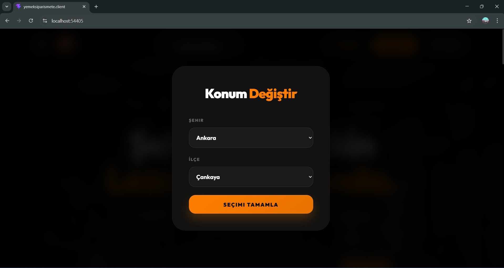
          <br><sub><b>📍 Bölge Filtreleme</b></sub>
        </td>
        <td align="center" style="border: 4px solid #FF0000 !important; padding: 10px; vertical-align: top;">
          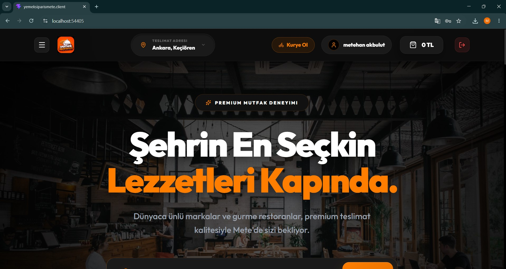
          <br><sub><b>🏠 Ana Dashboard</b></sub>
        </td>
        <td align="center" style="border: 4px solid #FF0000 !important; padding: 10px; vertical-align: top;">
          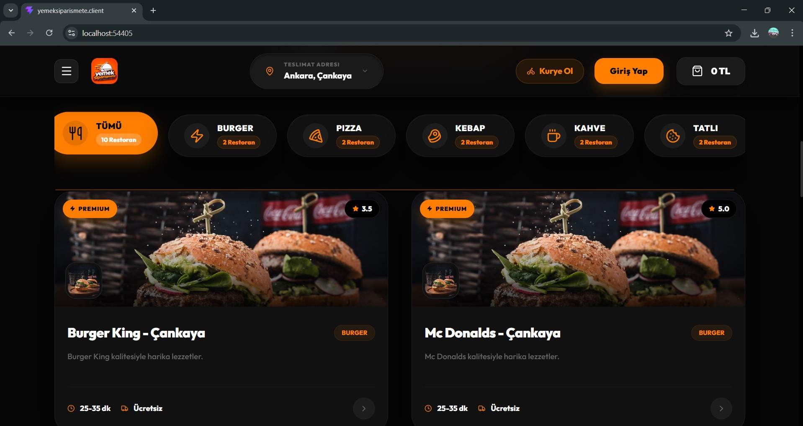
          <br><sub><b>🍴 Restoran Katalog</b></sub>
        </td>
        <td align="center" style="border: 4px solid #FF0000 !important; padding: 10px; vertical-align: top;">
          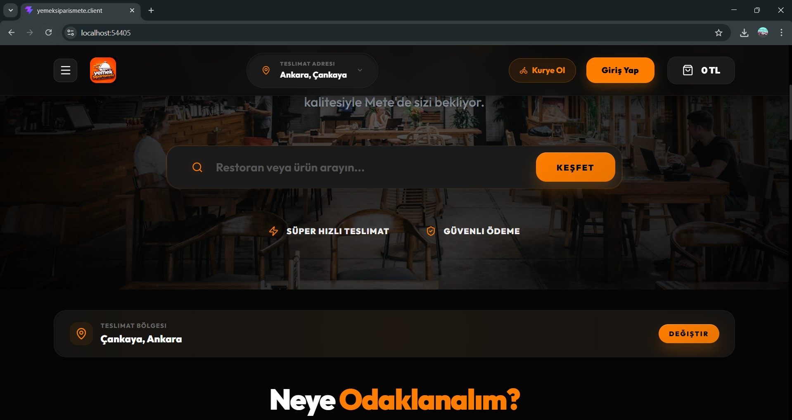
          <br><sub><b>🔍 Akıllı Arama</b></sub>
        </td>
      </tr>
      <!-- Satır 2 -->
      <tr style="border: 4px solid #FF0000 !important; background-color: transparent !important;">
        <td align="center" style="border: 4px solid #FF0000 !important; padding: 10px; vertical-align: top;">
          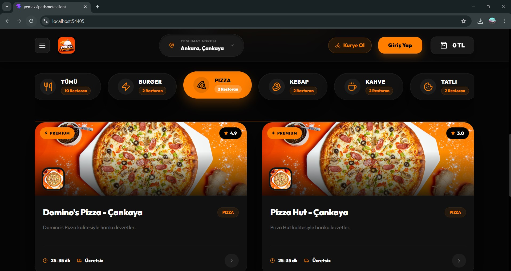
          <br><sub><b>🍕 Pizza Dünyası</b></sub>
        </td>
        <td align="center" style="border: 4px solid #FF0000 !important; padding: 10px; vertical-align: top;">
          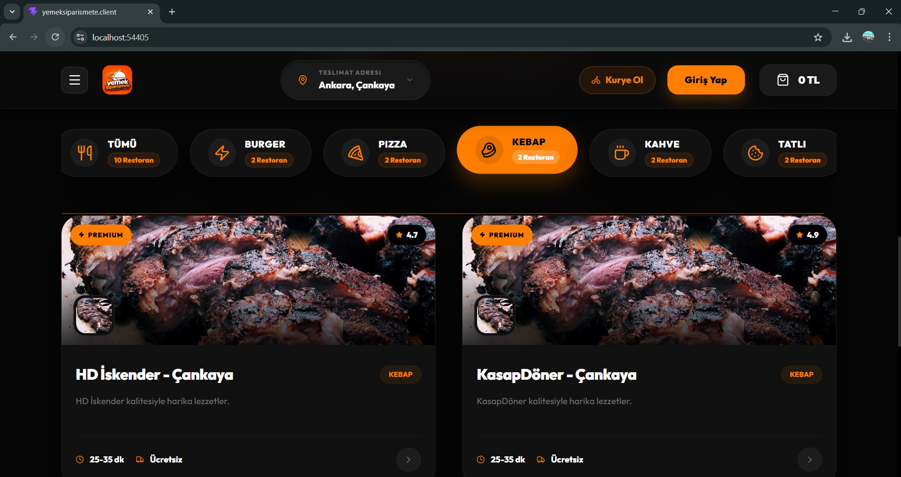
          <br><sub><b>🍢 Kebap Kültürü</b></sub>
        </td>
        <td align="center" style="border: 4px solid #FF0000 !important; padding: 10px; vertical-align: top;">
          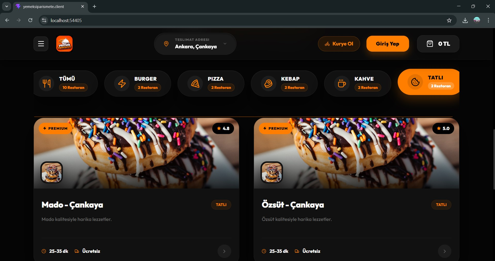
          <br><sub><b>🍰 Tatlı Serüveni</b></sub>
        </td>
        <td align="center" style="border: 4px solid #FF0000 !important; padding: 10px; vertical-align: top;">
          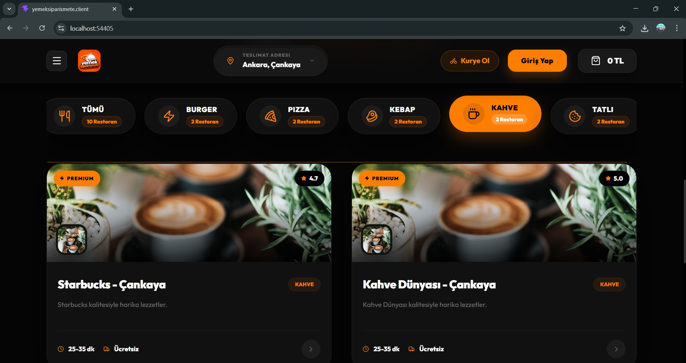
          <br><sub><b>☕ Kahve & İçecek</b></sub>
        </td>
      </tr>
      <!-- Satır 3 -->
      <tr style="border: 4px solid #FF0000 !important; background-color: transparent !important;">
        <td align="center" style="border: 4px solid #FF0000 !important; padding: 10px; vertical-align: top;">
          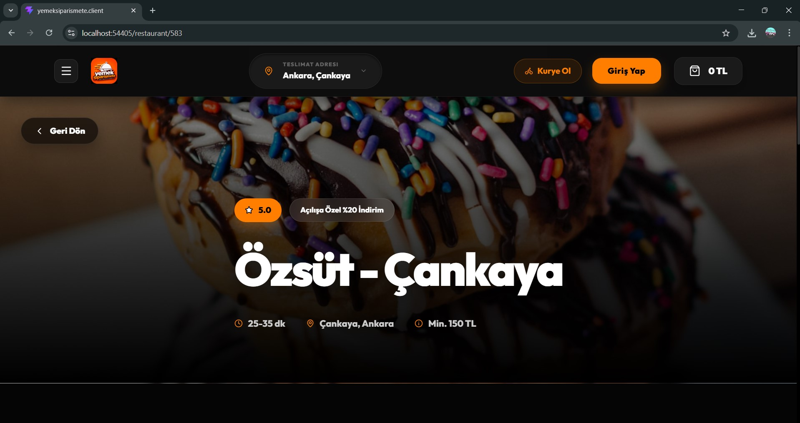
          <br><sub><b>🏪 Örnek Restaurant</b></sub>
        </td>
        <td align="center" style="border: 4px solid #FF0000 !important; padding: 10px; vertical-align: top;">
          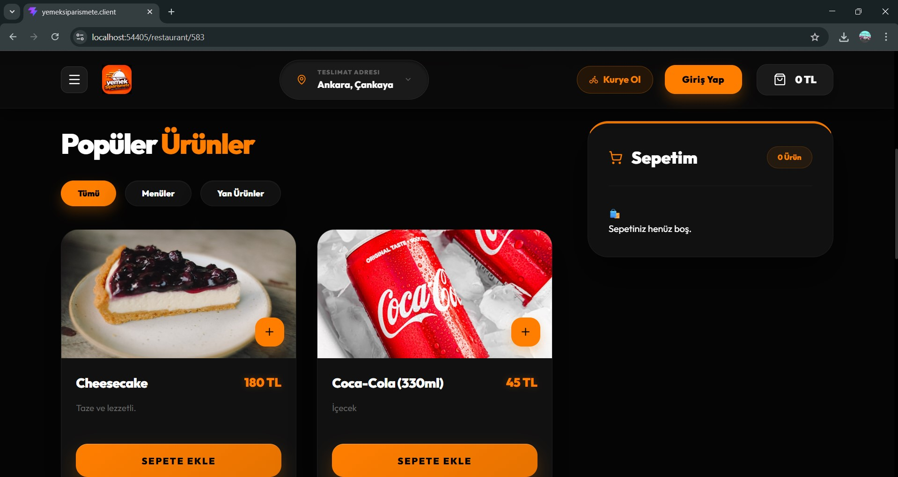
          <br><sub><b>🍔 Örnek Ürünler</b></sub>
        </td>
        <td align="center" style="border: 4px solid #FF0000 !important; padding: 10px; vertical-align: top;">
          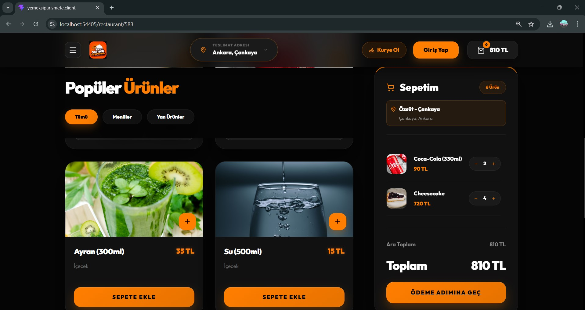
          <br><sub><b>🛒 Örnek Sepet</b></sub>
        </td>
        <td align="center" style="border: 4px solid #FF0000 !important; padding: 10px; vertical-align: top;">
          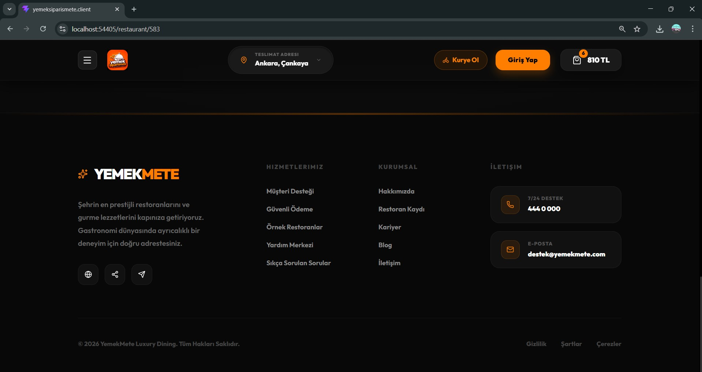
          <br><sub><b>📄 Bilgi & Footer</b></sub>
        </td>
      </tr>
      <!-- Satır 4 -->
      <tr style="border: 4px solid #FF0000 !important; background-color: transparent !important;">
        <td align="center" style="border: 4px solid #FF0000 !important; padding: 10px; vertical-align: top;">
          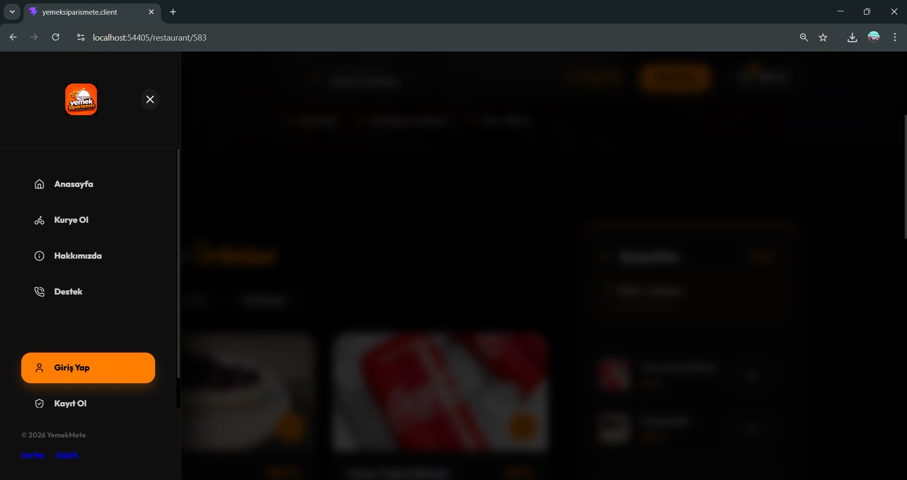
          <br><sub><b>📱 Yan Menü Navigasyon</b></sub>
        </td>
        <td align="center" style="border: 4px solid #FF0000 !important; padding: 10px; vertical-align: top;">
          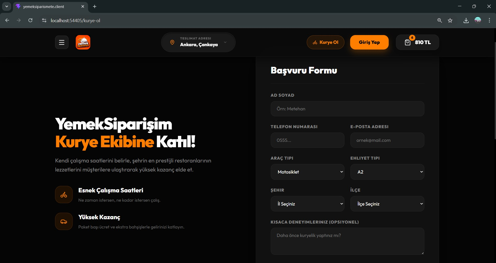
          <br><sub><b>🚲 Kurye Başvuru Sistemi</b></sub>
        </td>
        <td align="center" style="border: 4px solid #FF0000 !important; padding: 10px; vertical-align: top;">
          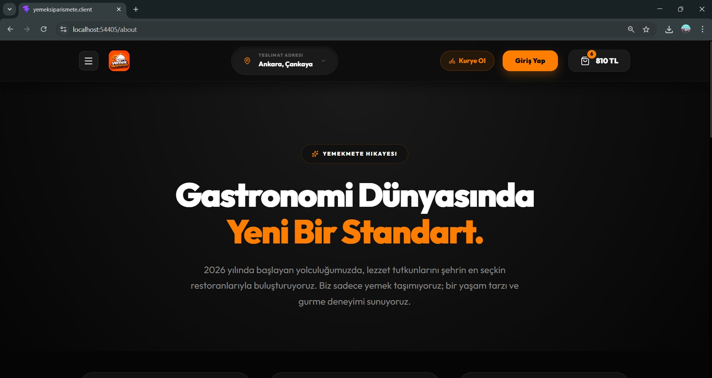
          <br><sub><b>ℹ️ Hakkında</b></sub>
        </td>
        <td align="center" style="border: 4px solid #FF0000 !important; padding: 10px; vertical-align: top;">
          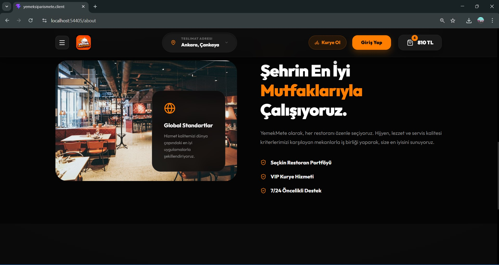
          <br><sub><b>ℹ️ Hakkında Devam</b></sub>
        </td>
      </tr>
      <!-- Satır 5 -->
      <tr style="border: 4px solid #FF0000 !important; background-color: transparent !important;">
        <td align="center" style="border: 4px solid #FF0000 !important; padding: 10px; vertical-align: top;">
          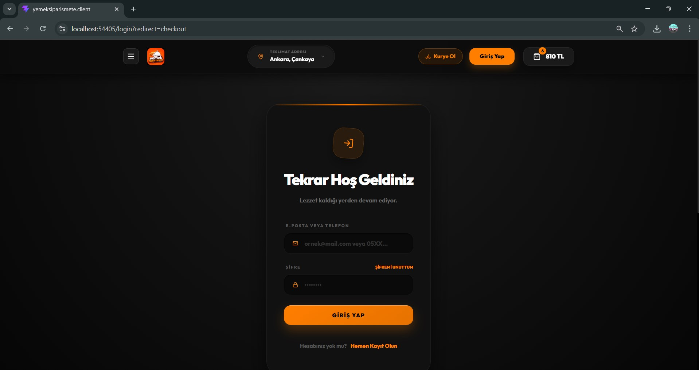
          <br><sub><b>🔐 Kullanıcı Girişi</b></sub>
        </td>
        <td align="center" style="border: 4px solid #FF0000 !important; padding: 10px; vertical-align: top;">
          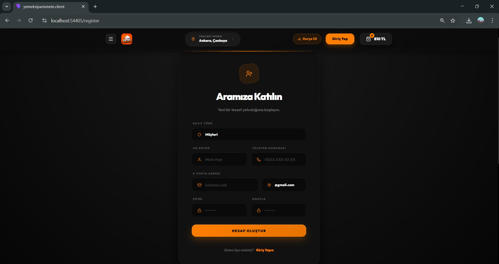
          <br><sub><b>📝 Yeni Kayıt Ekranı</b></sub>
        </td>
        <td align="center" style="border: 4px solid #FF0000 !important; padding: 10px; vertical-align: top;">
          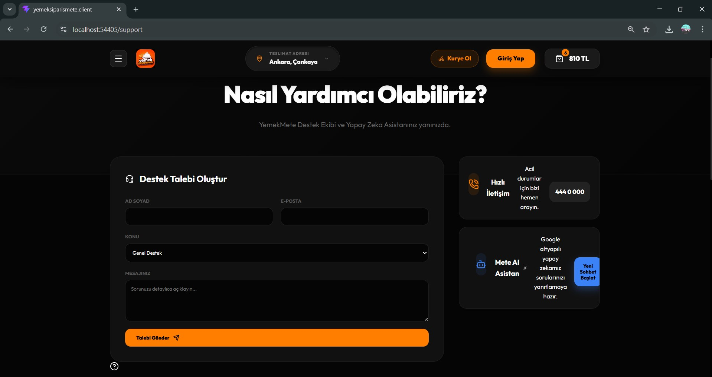
          <br><sub><b>🎧 Canlı Destek Sistemi</b></sub>
        </td>
        <td align="center" style="border: 4px solid #FF0000 !important; padding: 10px; vertical-align: top;">
          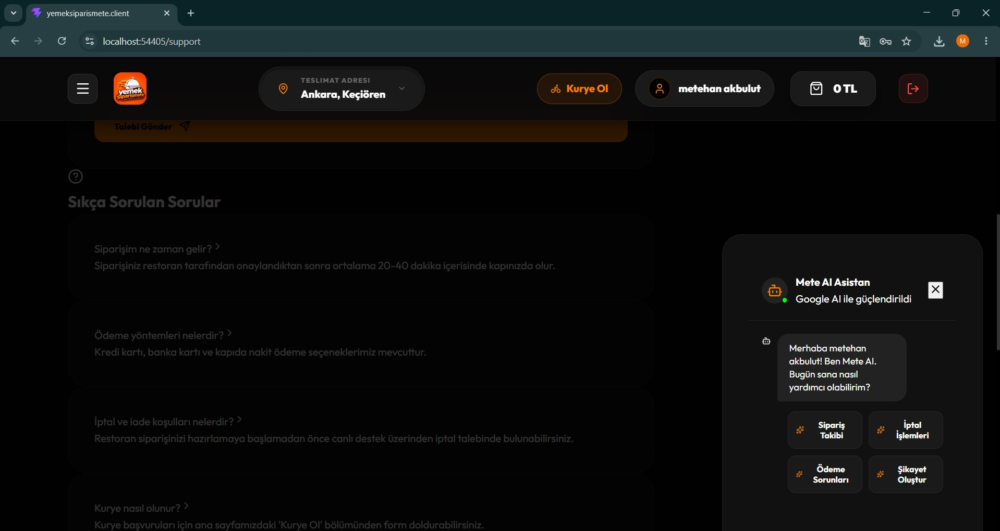
          <br><sub><b>❓ Yardım Merkezi</b></sub>
        </td>
      </tr>
      <!-- Satır 6 -->
      <tr style="border: 4px solid #FF0000 !important; background-color: transparent !important;">
        <td align="center" style="border: 4px solid #FF0000 !important; padding: 10px; vertical-align: top;">
          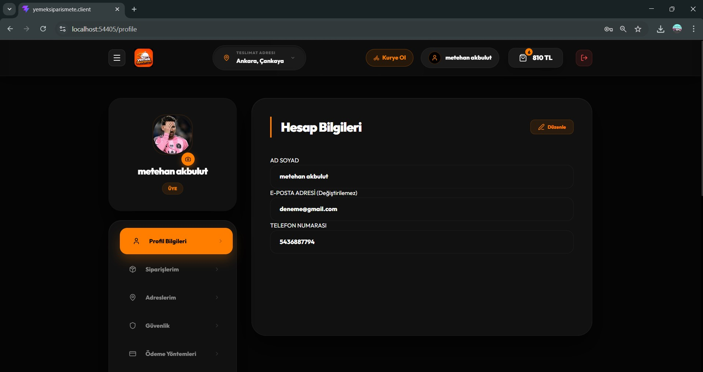
          <br><sub><b>👤 Kullanıcı Profili</b></sub>
        </td>
        <td align="center" style="border: 4px solid #FF0000 !important; padding: 10px; vertical-align: top;">
          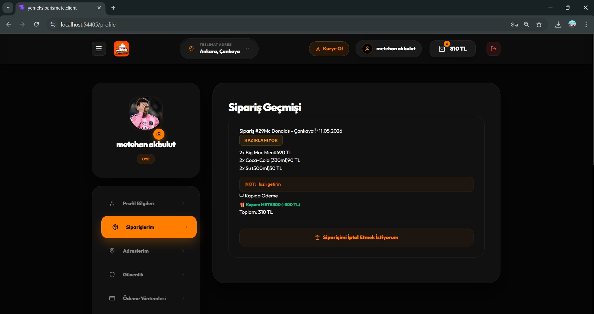
          <br><sub><b>📦 Sipariş Geçmişi</b></sub>
        </td>
        <td align="center" style="border: 4px solid #FF0000 !important; padding: 10px; vertical-align: top;">
          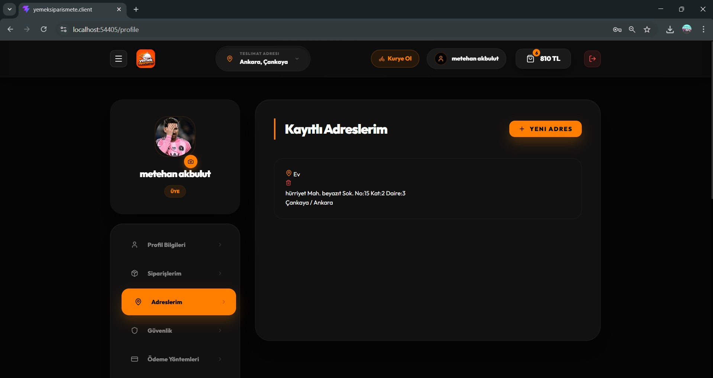
          <br><sub><b>📍 Teslimat Adreslerim</b></sub>
        </td>
        <td align="center" style="border: 4px solid #FF0000 !important; padding: 10px; vertical-align: top;">
          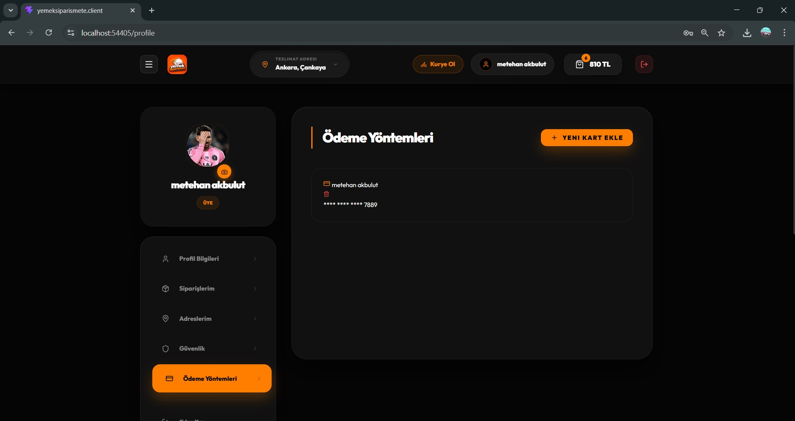
          <br><sub><b>💳 Ödeme Yöntemleri</b></sub>
        </td>
      </tr>
      <!-- Satır 7 -->
      <tr style="border: 4px solid #FF0000 !important; background-color: transparent !important;">
        <td align="center" style="border: 4px solid #FF0000 !important; padding: 10px; vertical-align: top;">
          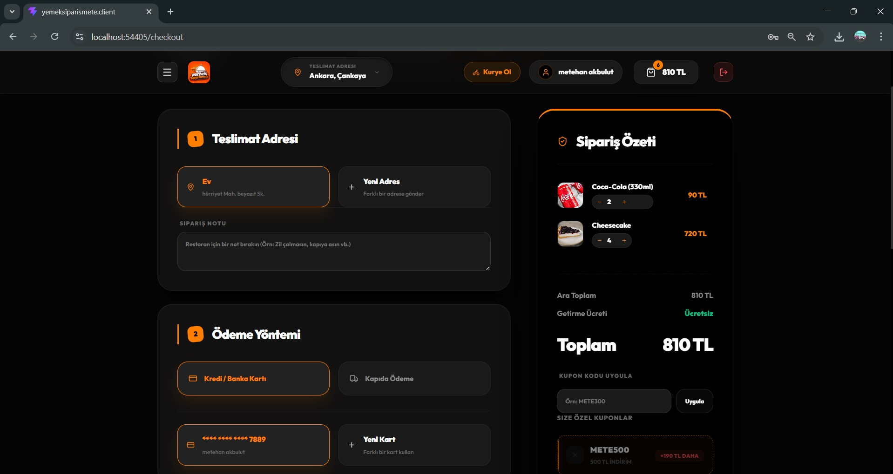
          <br><sub><b>📝 Sipariş Onayları</b></sub>
        </td>
        <td align="center" style="border: 4px solid #FF0000 !important; padding: 10px; vertical-align: top;">
          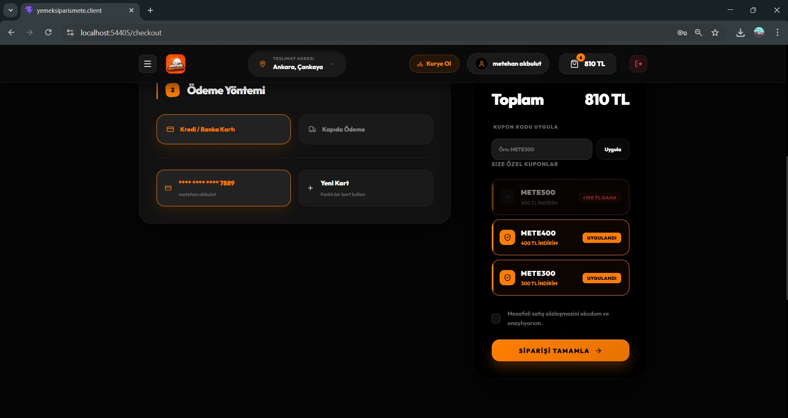
          <br><sub><b>🎫 İndirim Kuponları</b></sub>
        </td>
        <td align="center" style="border: 4px solid #FF0000 !important; padding: 10px; vertical-align: top;">
          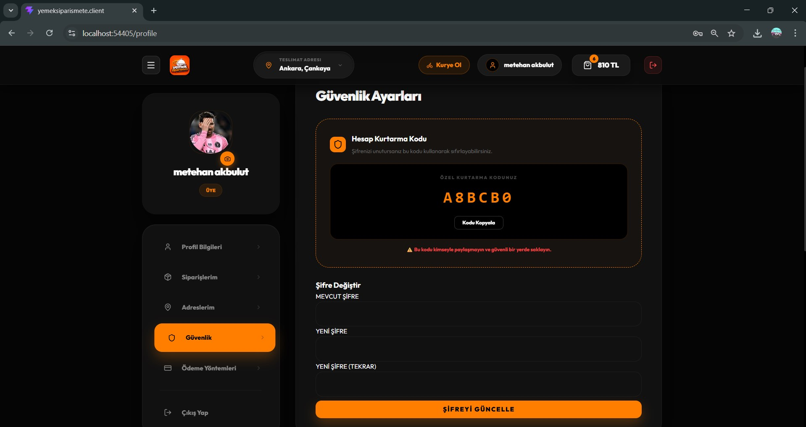
          <br><sub><b>🔒 İşlem Güvenliği</b></sub>
        </td>
        <td align="center" style="border: 4px solid #FF0000 !important; padding: 10px; vertical-align: top;">
          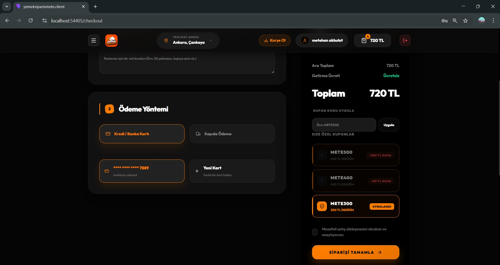
          <br><sub><b>🎁 Kampanyalar</b></sub>
        </td>
      </tr>
      <!-- Satır 8 -->
      <tr style="border: 4px solid #FF0000 !important; background-color: transparent !important;">
        <td align="center" style="border: 4px solid #FF0000 !important; padding: 10px; vertical-align: top;">
          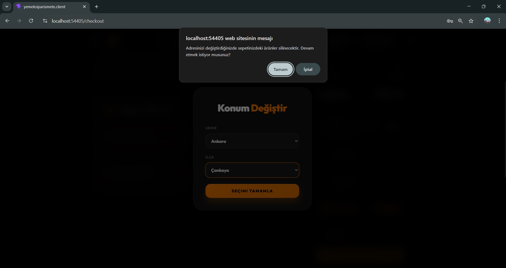
          <br><sub><b>🔄 Konum Güncelleme</b></sub>
        </td>
        <td align="center" style="border: 4px solid #FF0000 !important; padding: 10px; vertical-align: top;">
          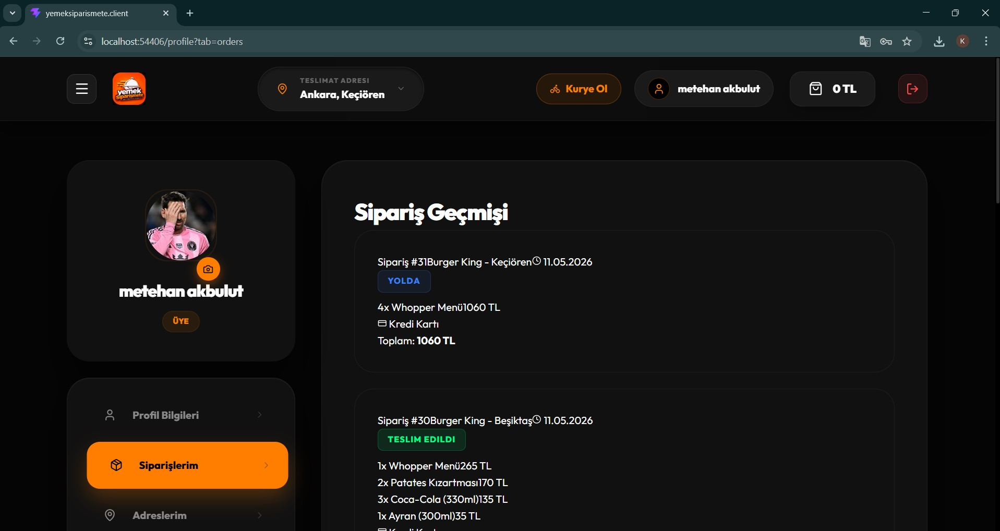
          <br><sub><b>🛵 Sipariş Yolda</b></sub>
        </td>
        <td align="center" style="border: 4px solid #FF0000 !important; padding: 10px; vertical-align: top;">
          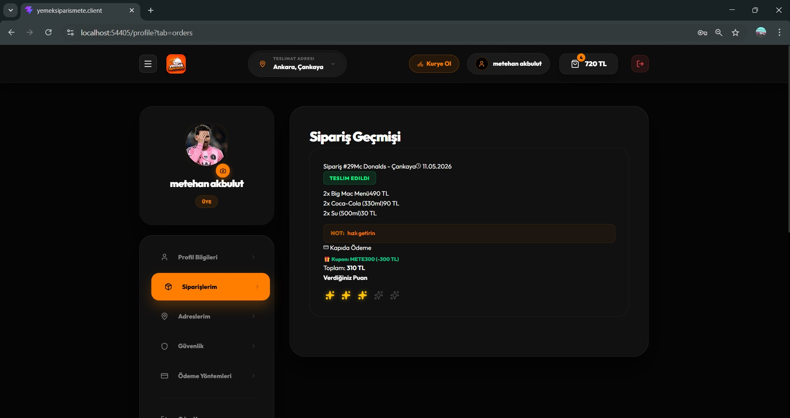
          <br><sub><b>⭐ Değerlendirme</b></sub>
        </td>
        <td align="center" style="border: 4px solid #FF0000 !important; padding: 10px; vertical-align: top;">
          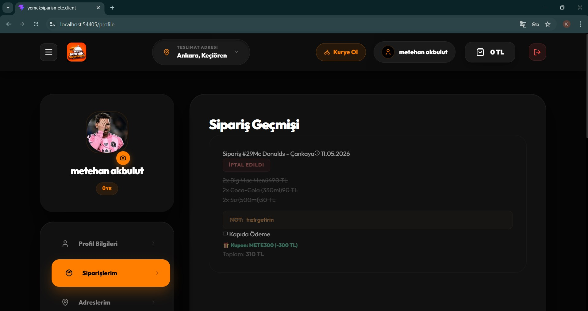
          <br><sub><b>❌ Sipariş İptal</b></sub>
        </td>
      </tr>
    </tbody>
  </table>
</div>
<br>
<div align="center">
  <table style="width: 100%; table-layout: fixed; border-collapse: collapse !important; border: 4px solid #FF0000 !important;">
    <thead>
      <tr style="border: 4px solid #FF0000 !important; background-color: transparent !important;">
        <th colspan="4" align="center" style="border: 4px solid #FF0000 !important; padding: 20px 0;">
          <h3>⚙️ Web Yönetim Paneli </h3>
        </th>
      </tr>
    </thead>
    <tbody>
      <!-- Satır 1 -->
      <tr style="border: 4px solid #FF0000 !important; background-color: transparent !important;">
        <td align="center" style="border: 4px solid #FF0000 !important; padding: 10px; vertical-align: top;">
          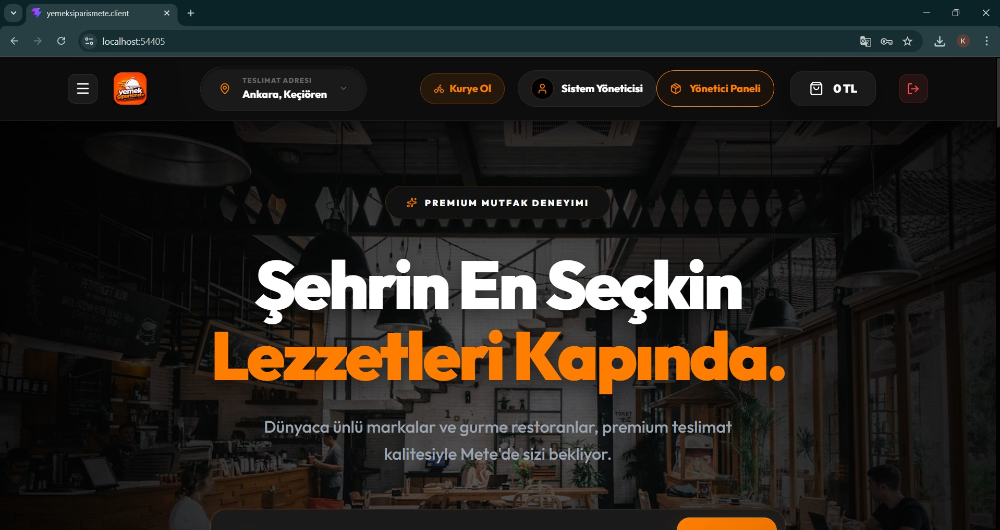
          <br><sub><b>📊 Yönetici Özeti</b></sub>
        </td>
        <td align="center" style="border: 4px solid #FF0000 !important; padding: 10px; vertical-align: top;">
          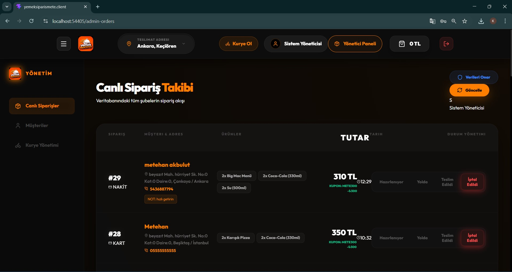
          <br><sub><b>📑 Sipariş Denetimi</b></sub>
        </td>
        <td align="center" style="border: 4px solid #FF0000 !important; padding: 10px; vertical-align: top;">
          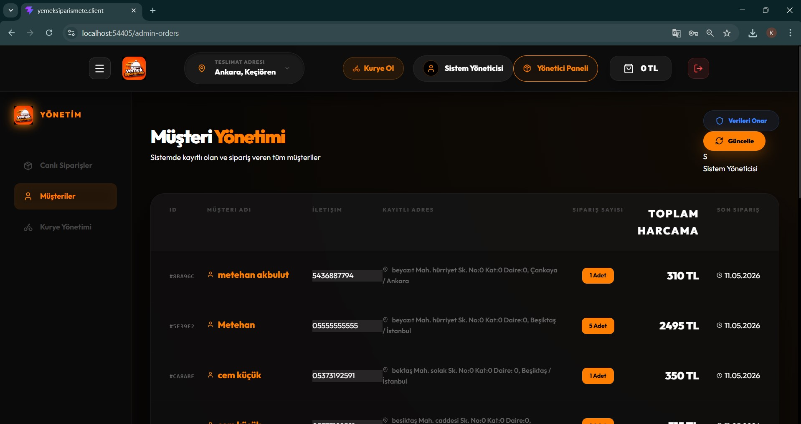
          <br><sub><b>👥 Müşteri Portföyü</b></sub>
        </td>
        <td align="center" style="border: 4px solid #FF0000 !important; padding: 10px; vertical-align: top;">
          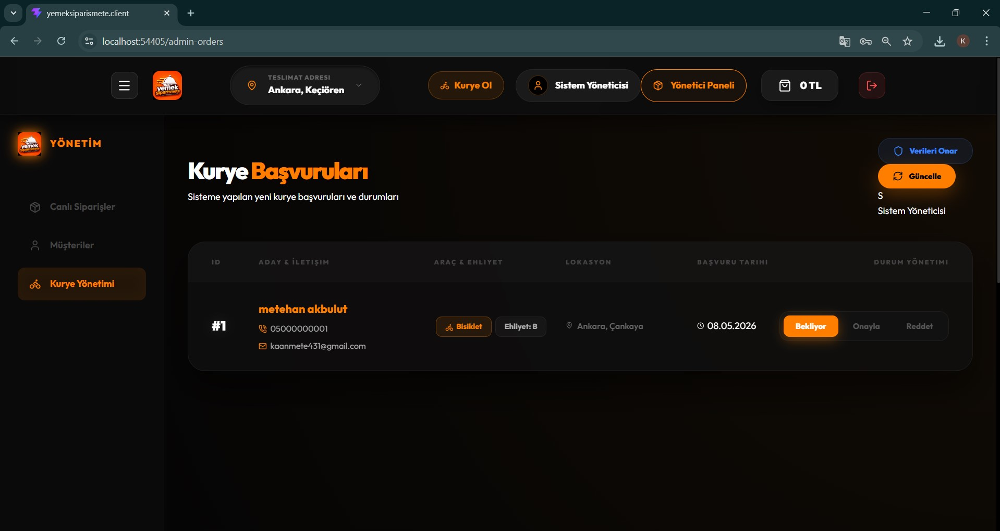
          <br><sub><b>🛵 Kurye Operasyonu</b></sub>
        </td>
      </tr>
      <!-- Satır 2 -->
      <tr style="border: 4px solid #FF0000 !important; background-color: transparent !important;">
        <td align="center" style="border: 4px solid #FF0000 !important; padding: 10px; vertical-align: top;">
          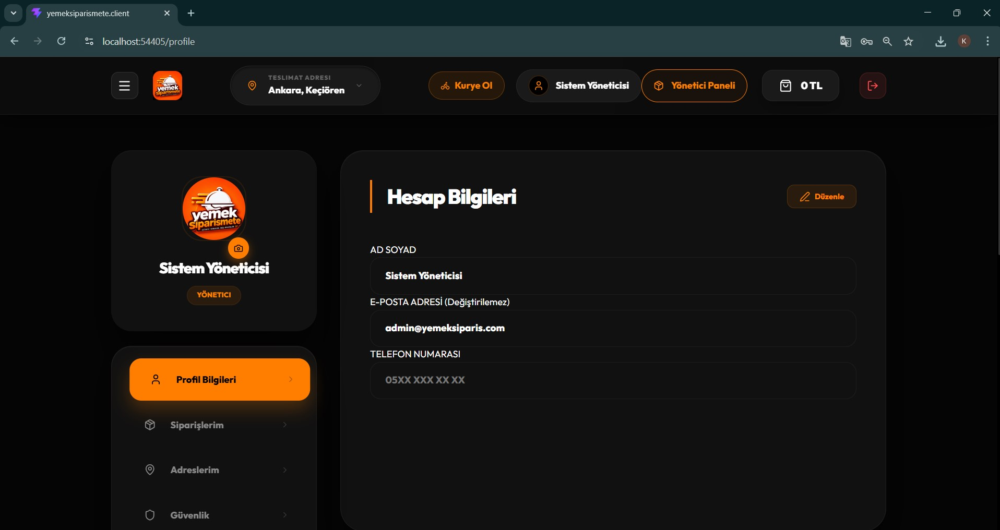
          <br><sub><b>👤 Yetki & Hesap Ayarları</b></sub>
        </td>
        <td align="center" style="border: 4px solid #FF0000 !important; padding: 10px; vertical-align: top;">
          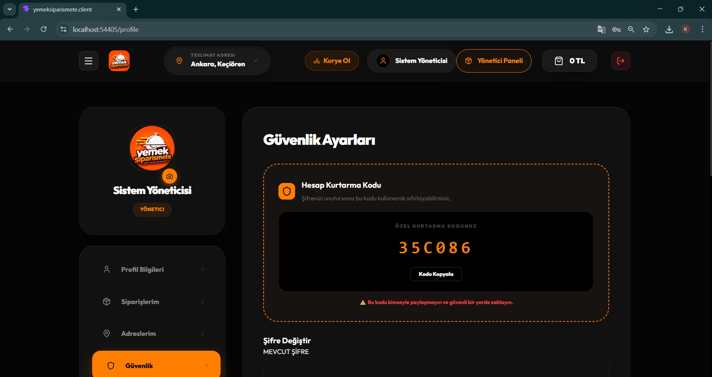
          <br><sub><b>🛡️ Admin Güvenlik Duvarı</b></sub>
        </td>
        <td align="center" style="border: 4px solid #FF0000 !important; padding: 10px; vertical-align: top;">
          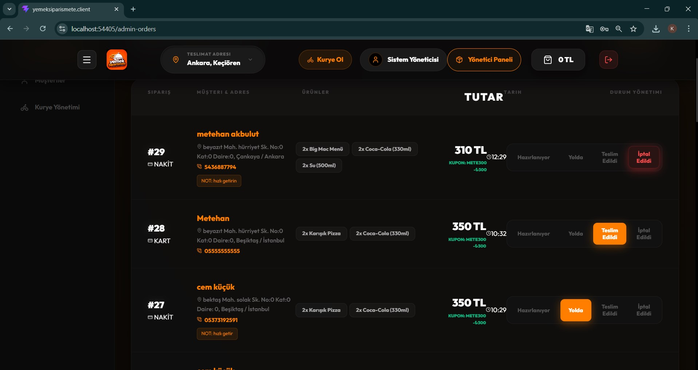
          <br><sub><b>🎮 Genel Kontrol Merkezi</b></sub>
        </td>
        <td align="center" style="border: 4px solid #FF0000 !important; padding: 10px; vertical-align: top;">
          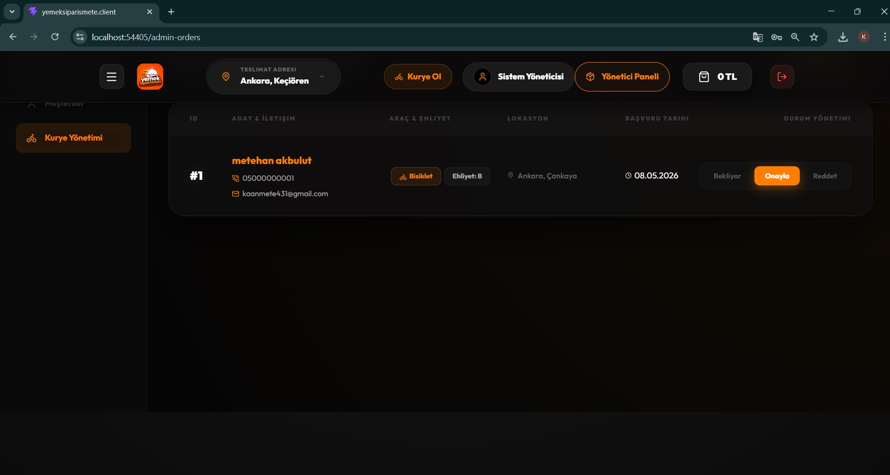
          <br><sub><b>📡 Kurye Kabul ve Red</b></sub>
        </td>
      </tr>
    </tbody>
  </table>
</div>
<br>
<div align="center">
  <table style="width: 100%; table-layout: fixed; border-collapse: collapse !important; border: 4px solid #FF0000 !important;">
    <thead>
      <tr style="border: 4px solid #FF0000 !important; background-color: transparent !important;">
        <th colspan="4" align="center" style="border: 4px solid #FF0000 !important; padding: 20px 0;">
          <h3>⚙️Web Restoran Yönetim Paneli</h3>
        </th>
      </tr>
    </thead>
    <tbody>
      <!-- Satır 1 -->
      <tr style="border: 4px solid #FF0000 !important; background-color: transparent !important;">
        <td align="center" style="border: 4px solid #FF0000 !important; padding: 10px; vertical-align: top;">
          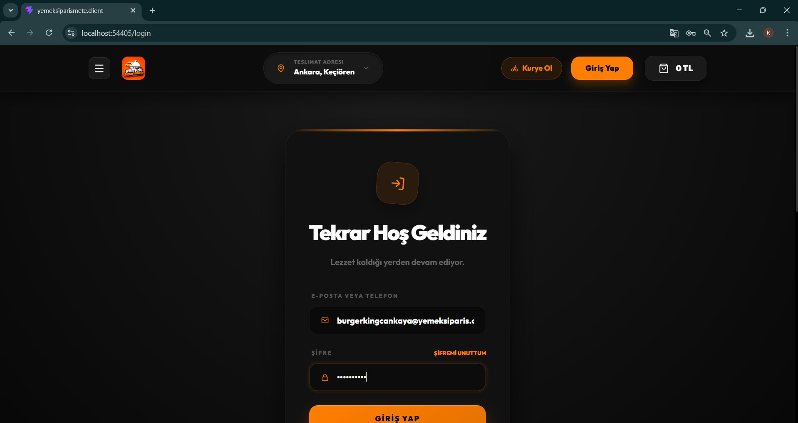
          <br><sub><b>🔐 Restoran Girişi</b></sub>
        </td>
        <td align="center" style="border: 4px solid #FF0000 !important; padding: 10px; vertical-align: top;">
          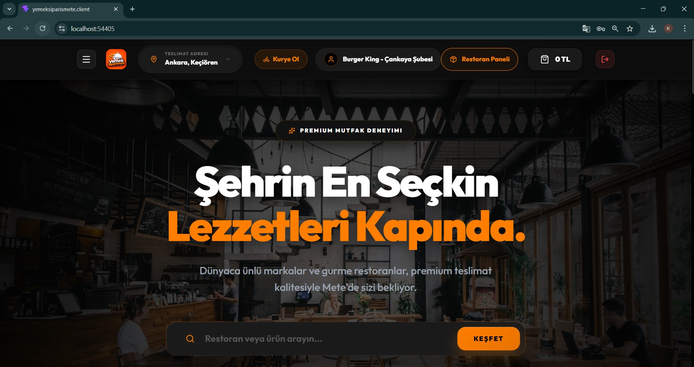
          <br><sub><b>📊 Mağaza Paneli</b></sub>
        </td>
        <td align="center" style="border: 4px solid #FF0000 !important; padding: 10px; vertical-align: top;">
          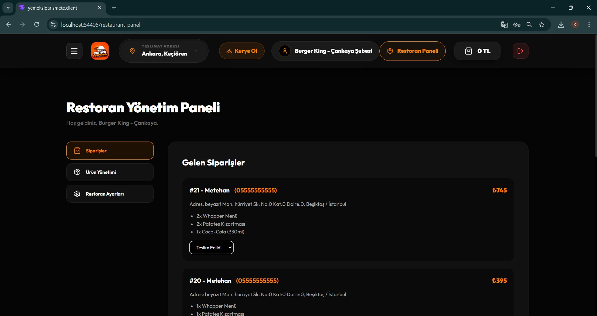
          <br><sub><b>📝 Sipariş Yönetimi</b></sub>
        </td>
        <td align="center" style="border: 4px solid #FF0000 !important; padding: 10px; vertical-align: top;">
          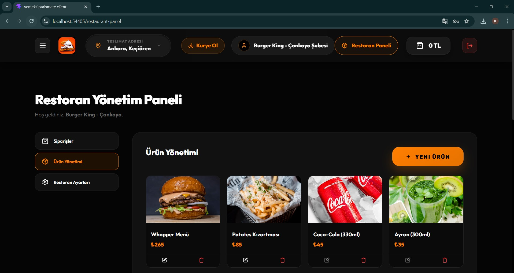
          <br><sub><b>🍔 Ürün Portföyü</b></sub>
        </td>
      </tr>
      <!-- Satır 2 -->
      <tr style="border: 4px solid #FF0000 !important; background-color: transparent !important;">
        <td align="center" style="border: 4px solid #FF0000 !important; padding: 10px; vertical-align: top;">
          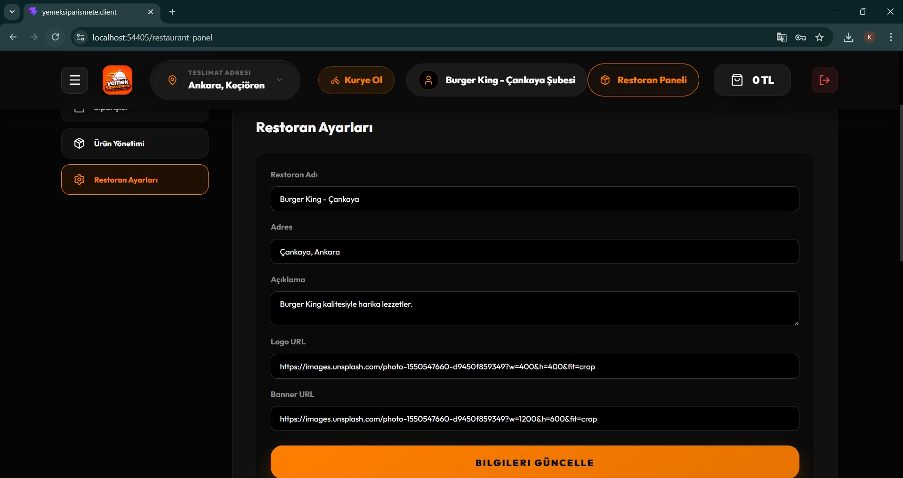
          <br><sub><b>⚙️ Restoran Ayarları</b></sub>
        </td>
        <td align="center" style="border: 4px solid #FF0000 !important; padding: 10px; vertical-align: top;">
          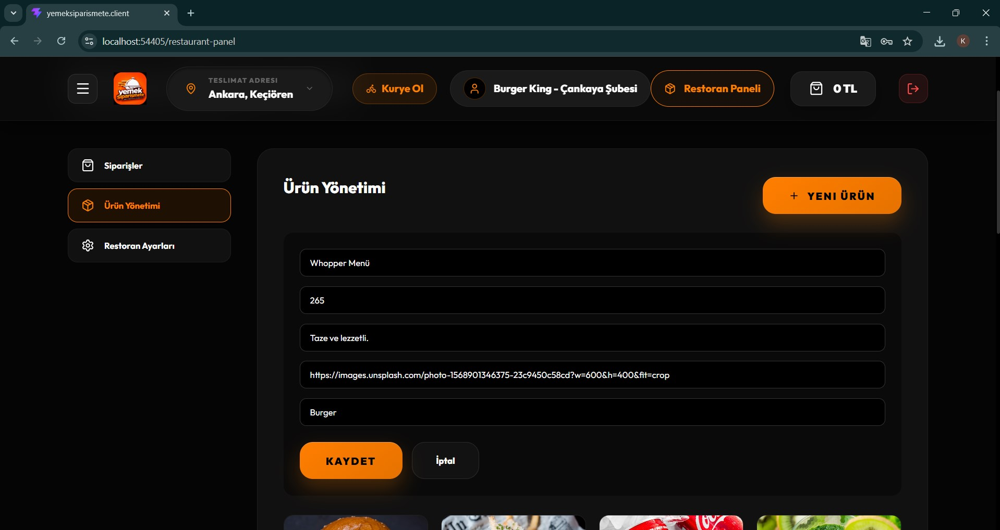
          <br><sub><b>🔄 Ürün Bilgi Güncelleme</b></sub>
        </td>
        <td align="center" style="border: 4px solid #FF0000 !important; padding: 10px; vertical-align: top;">
          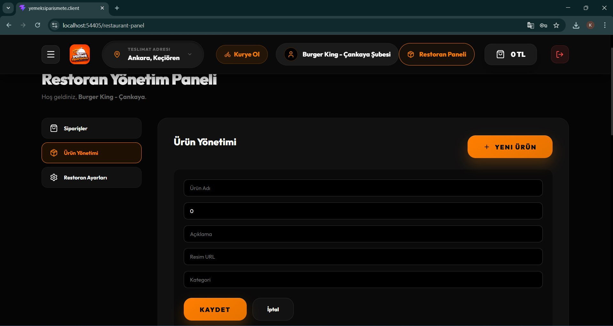
          <br><sub><b>➕ Yeni Ürün Ekleme</b></sub>
        </td>
        <td align="center" style="border: 4px solid #FF0000 !important; padding: 10px; vertical-align: top;">
          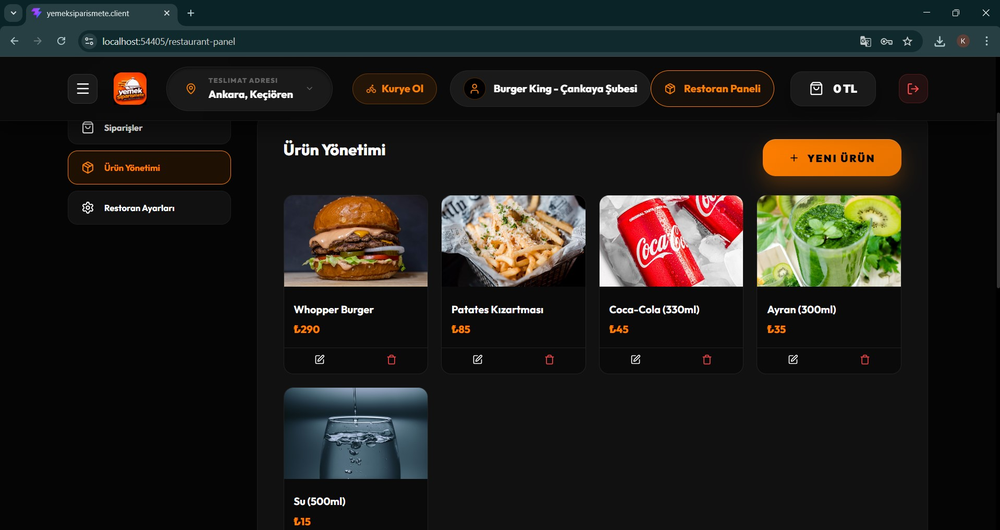
          <br><sub><b>🍔 Dinamik Menü Yönetimi</b></sub>
        </td>
      </tr>
    </tbody>
  </table>
</div>
<br>
<div align="center">
  <table style="width: 100%; table-layout: fixed; border-collapse: collapse !important; border: 4px solid #FF0000 !important;">
    <thead>
      <tr style="border: 4px solid #FF0000 !important; background-color: transparent !important;">
        <th colspan="4" align="center" style="border: 4px solid #FF0000 !important; padding: 20px 0;">
          <h3>🛵 Web Kurye Yönetim Paneli</h3>
        </th>
      </tr>
    </thead>
    <tbody>
      <!-- Birinci Satır -->
      <tr style="border: 4px solid #FF0000 !important; background-color: transparent !important;">
        <td align="center" style="border: 4px solid #FF0000 !important; padding: 10px; vertical-align: top;">
          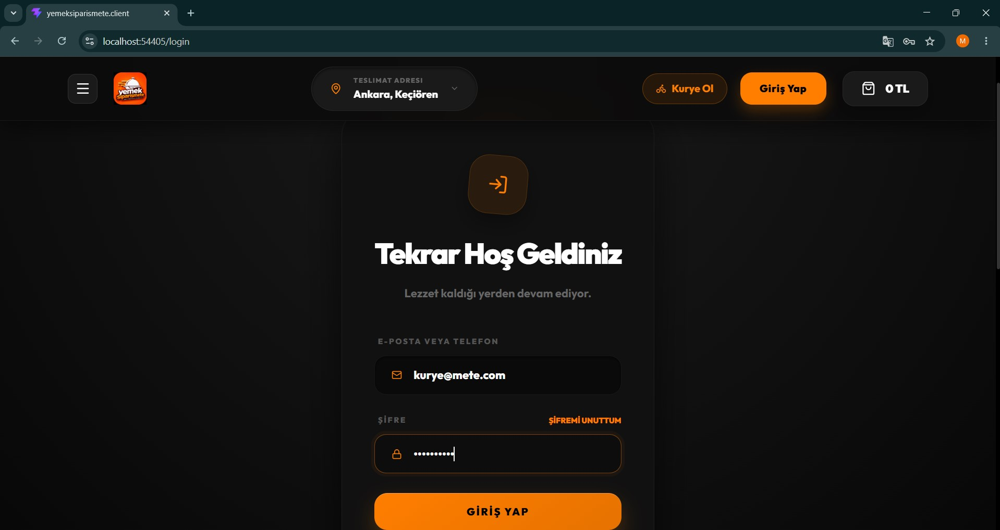
          <br><sub><b>🔐 Kurye Girişi</b></sub>
        </td>
        <td align="center" style="border: 4px solid #FF0000 !important; padding: 10px; vertical-align: top;">
          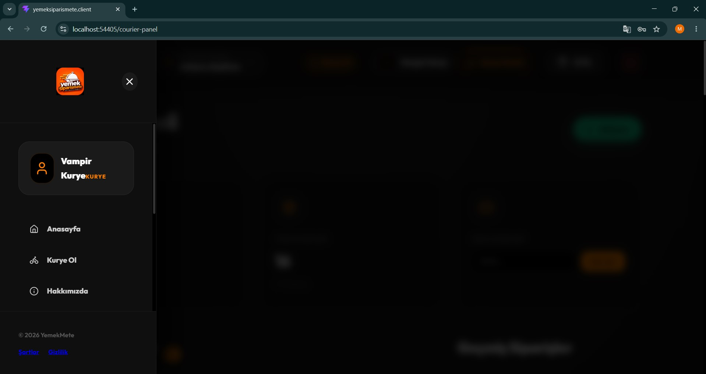
          <br><sub><b>👥 Rol Seçimi</b></sub>
        </td>
        <td align="center" style="border: 4px solid #FF0000 !important; padding: 10px; vertical-align: top;">
          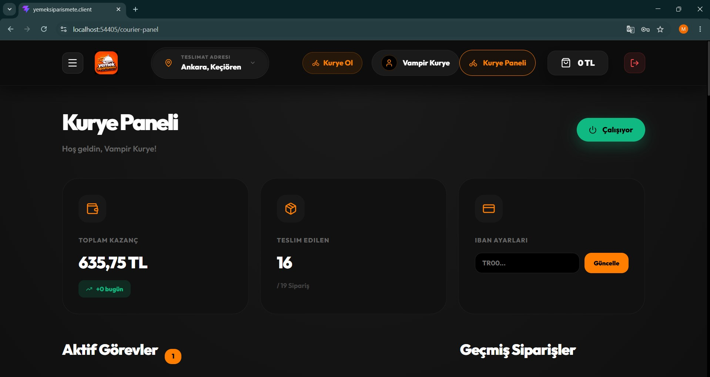
          <br><sub><b>📊 Kurye Paneli</b></sub>
        </td>
        <td align="center" style="border: 4px solid #FF0000 !important; padding: 10px; vertical-align: top;">
          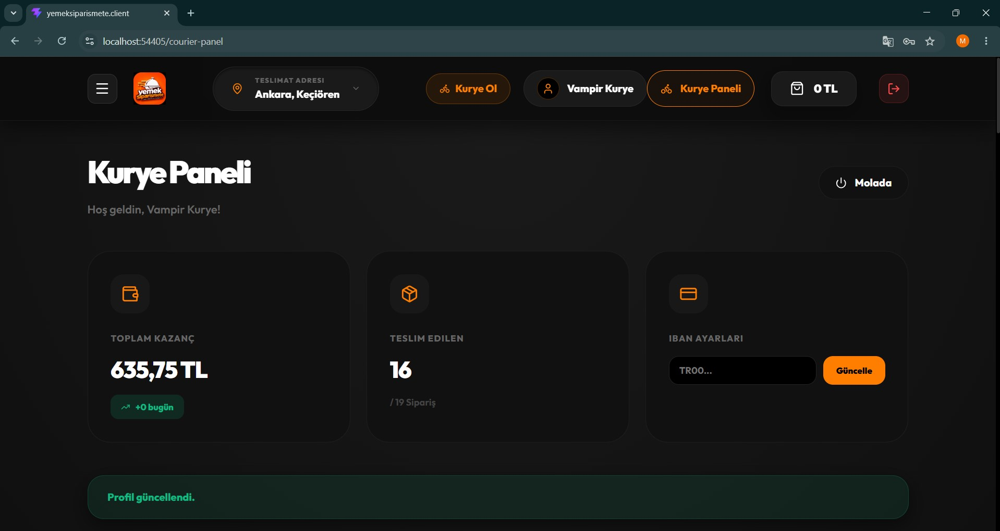
          <br><sub><b>🚥 Çalışma Modu</b></sub>
        </td>
      </tr>
      <!-- İkinci Satır -->
      <tr style="border: 4px solid #FF0000 !important; background-color: transparent !important;">
        <td align="center" style="border: 4px solid #FF0000 !important; padding: 10px; vertical-align: top;">
          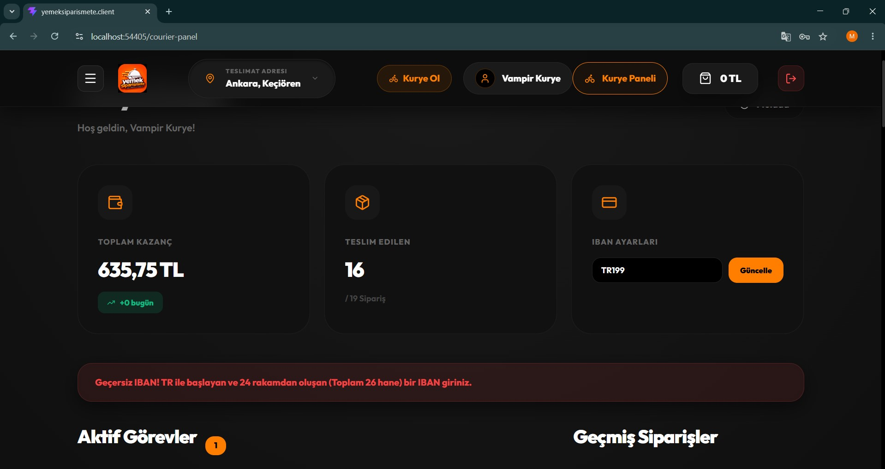
          <br><sub><b>💳 IBAN Kontrol</b></sub>
        </td>
        <td align="center" style="border: 4px solid #FF0000 !important; padding: 10px; vertical-align: top;">
          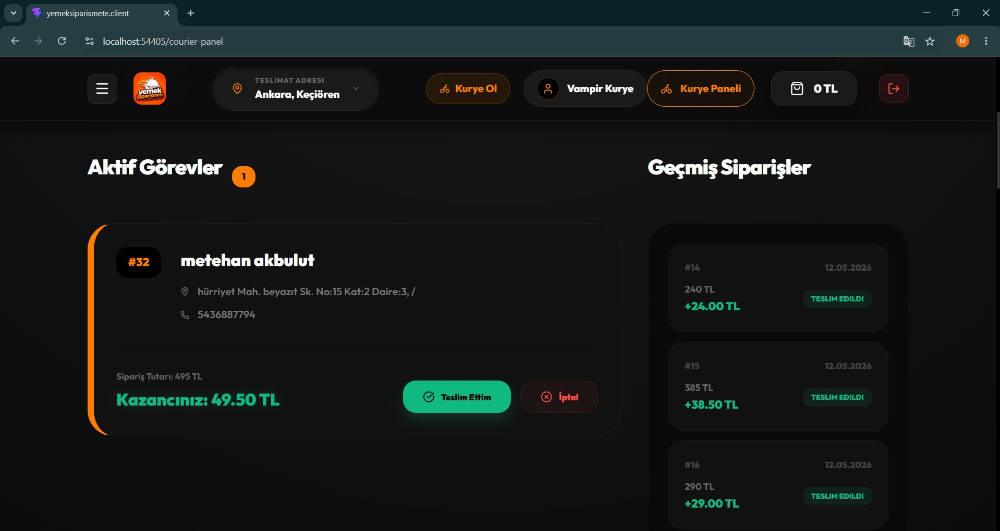
          <br><sub><b>📍 Aktif Görev</b></sub>
        </td>
        <td align="center" style="border: 4px solid #FF0000 !important; padding: 10px; vertical-align: top;">
          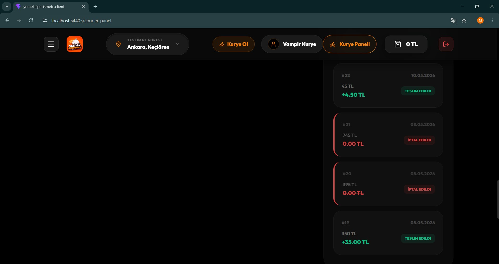
          <br><sub><b>❌ İptal Kayıtları</b></sub>
        </td>
        <td align="center" style="border: 4px solid #FF0000 !important; padding: 10px; vertical-align: top;">
          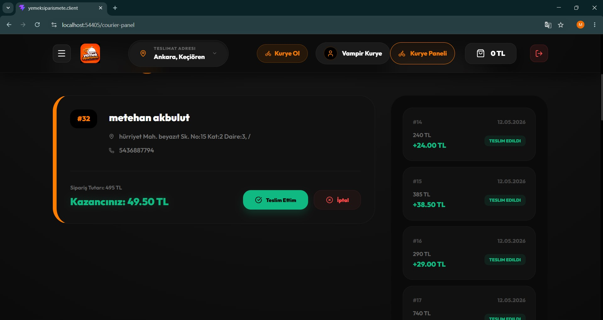
          <br><sub><b>✅ Teslimat Kayıtları</b></sub>
        </td>
      </tr>
    </tbody>
  </table>
</div>
<br>
<div align="center">
  <table style="width: 100%; table-layout: fixed; border-collapse: collapse !important; border: 4px solid #FF0000 !important;">
    <thead>
      <tr style="border: 4px solid #FF0000 !important; background-color: transparent !important;">
        <th colspan="4" align="center" style="border: 4px solid #FF0000 !important; padding: 20px 0;">
          <h3>🤝 Web Ortak Sipariş & Sosyal Modüller</h3>
        </th>
      </tr>
    </thead>
    <tbody>
      <tr style="border: 4px solid #FF0000 !important; background-color: transparent !important;">
        <td align="center" style="border: 4px solid #FF0000 !important; padding: 10px; vertical-align: top;">
          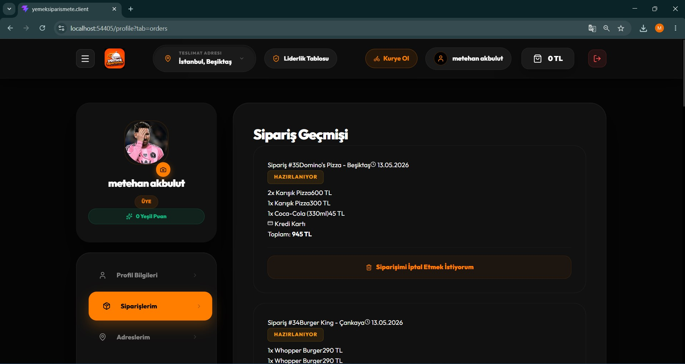
          <br><sub><b>👥 Ortak Siparişlerim</b></sub>
        </td>
        <td align="center" style="border: 4px solid #FF0000 !important; padding: 10px; vertical-align: top;">
          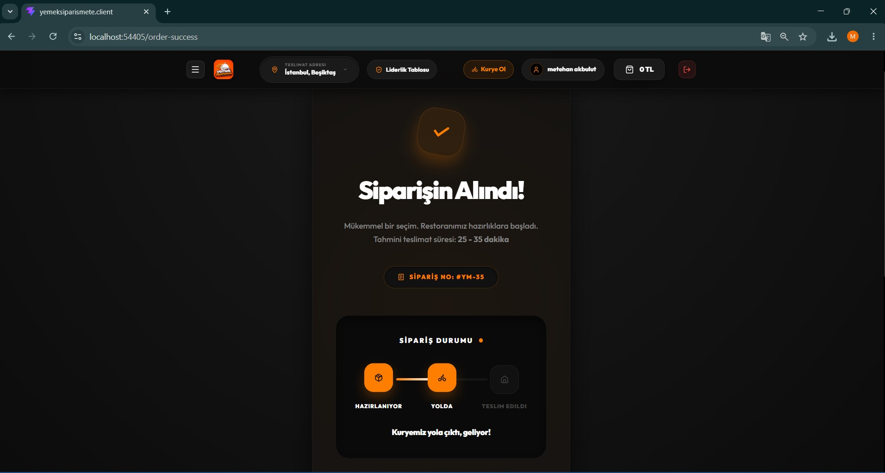
          <br><sub><b>🛒 Sipariş Oluşturma</b></sub>
        </td>
        <td align="center" style="border: 4px solid #FF0000 !important; padding: 10px; vertical-align: top;">
          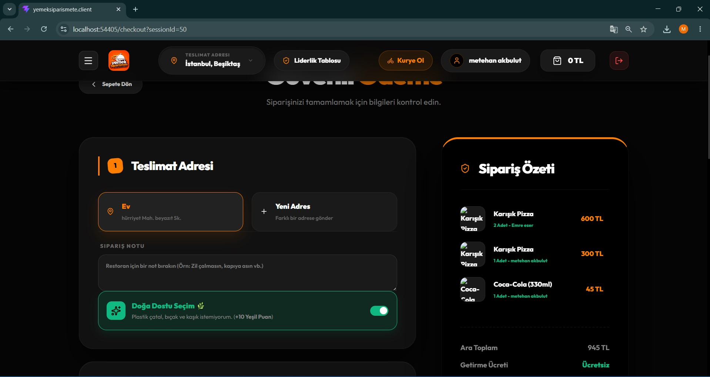
          <br><sub><b>🌿 Doğa Dostu Ödeme</b></sub>
        </td>
        <td align="center" style="border: 4px solid #FF0000 !important; padding: 10px; vertical-align: top;">
          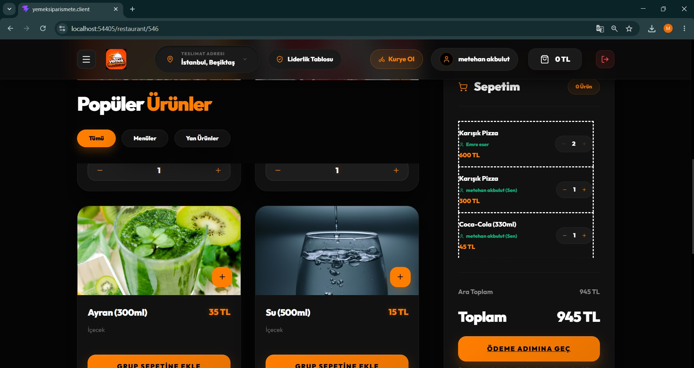
          <br><sub><b>🛍️ Grup Sepeti</b></sub>
        </td>
      </tr>
    </tbody>
  </table>
</div>
<br>
<div align="center">
  <table style="width: 100%; table-layout: fixed; border-collapse: collapse !important; border: 4px solid #FF0000 !important;">
    <thead>
      <tr style="border: 4px solid #FF0000 !important; background-color: transparent !important;">
        <th colspan="4" align="center" style="border: 4px solid #FF0000 !important; padding: 20px 0;">
          <h3>📊 Web Canlı Takip & Liderlik Tablosu</h3>
        </th>
      </tr>
    </thead>
    <tbody>
      <tr style="border: 4px solid #FF0000 !important; background-color: transparent !important;">
        <td align="center" style="border: 4px solid #FF0000 !important; padding: 10px; vertical-align: top;">
          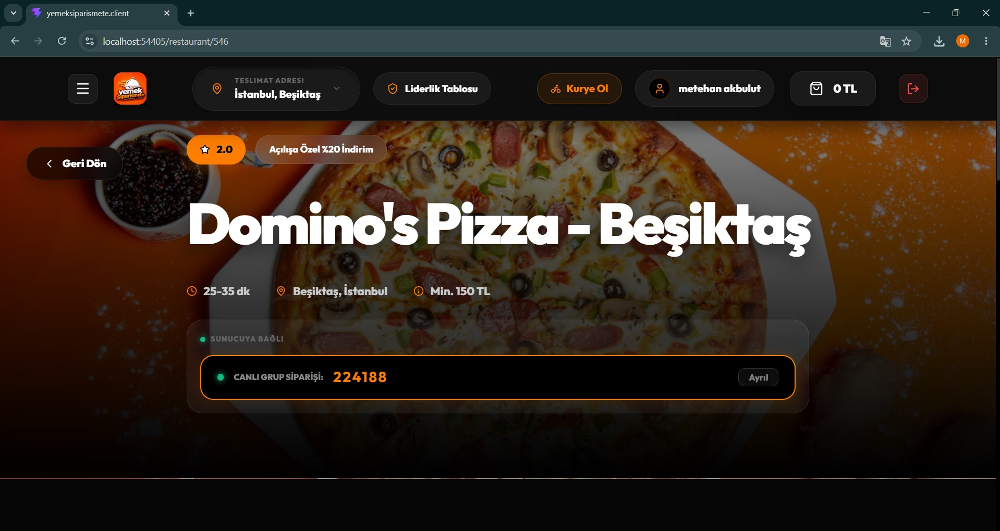
          <br><sub><b>⚡ Canlı Sipariş Kodu</b></sub>
        </td>
        <td align="center" style="border: 4px solid #FF0000 !important; padding: 10px; vertical-align: top;">
          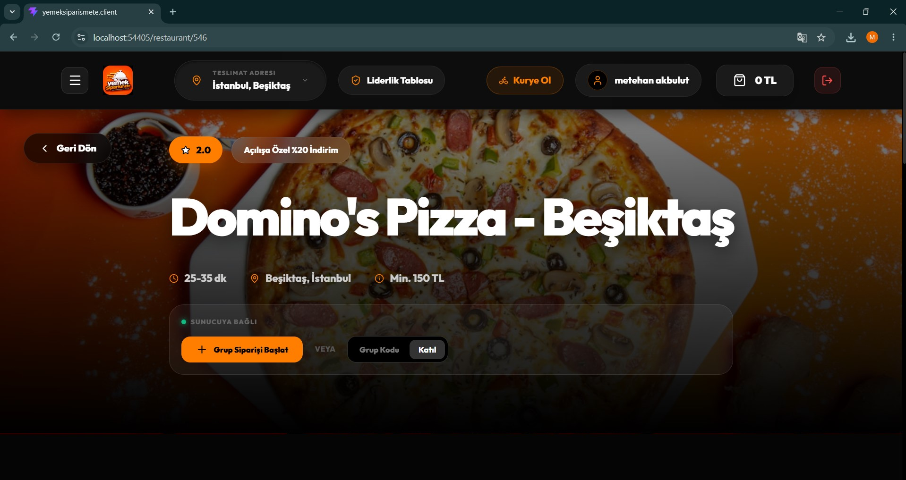
          <br><sub><b>🖥️ Yönetim Paneli</b></sub>
        </td>
        <td align="center" style="border: 4px solid #FF0000 !important; padding: 10px; vertical-align: top;">
          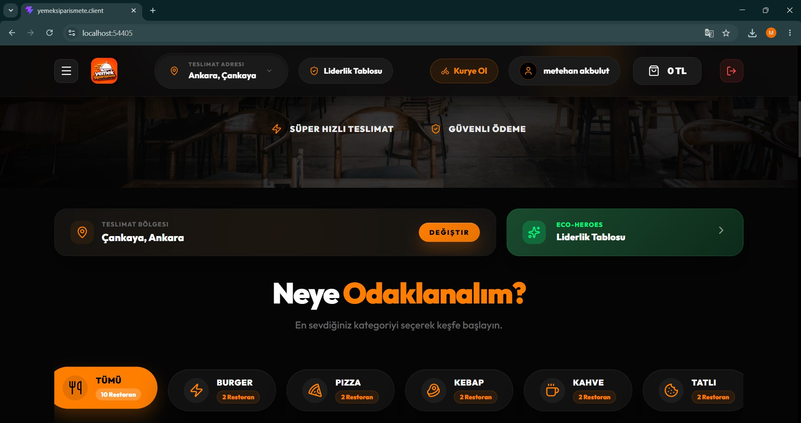
          <br><sub><b>🥇 Çevre Liderliği</b></sub>
        </td>
        <td align="center" style="border: 4px solid #FF0000 !important; padding: 10px; vertical-align: top;">
          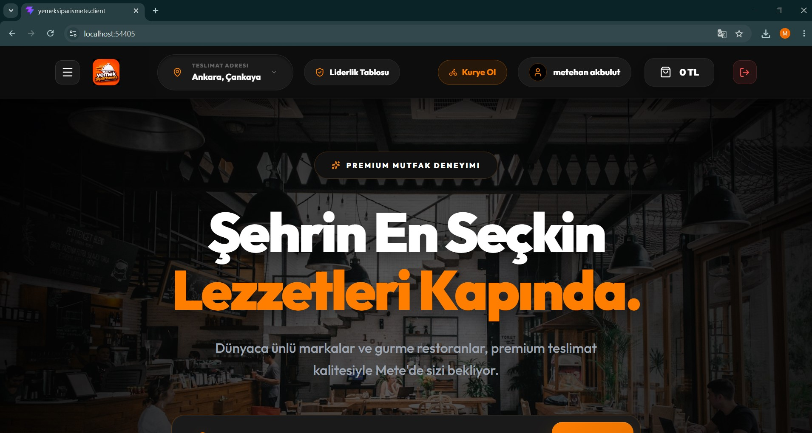
          <br><sub><b>✨ Başarı İkonları</b></sub>
        </td>
      </tr>
    </tbody>
  </table>
</div>
<br>
<div align="center">
  <table style="width: 100%; table-layout: fixed; border-collapse: collapse !important; border: 4px solid #FF0000 !important;">
    <thead>
      <tr style="border: 4px solid #FF0000 !important; background-color: transparent !important;">
        <th colspan="4" align="center" style="border: 4px solid #FF0000 !important; padding: 20px 0;">
          <h3>⚙️ Mobil Kullanıcı Paneli</h3>
        </th>
      </tr>
    </thead>
    <tbody>
      <!-- Satır 1 -->
      <tr style="border: 4px solid #FF0000 !important; background-color: transparent !important;">
        <td align="center" style="border: 4px solid #FF0000 !important; padding: 10px; vertical-align: top;">
          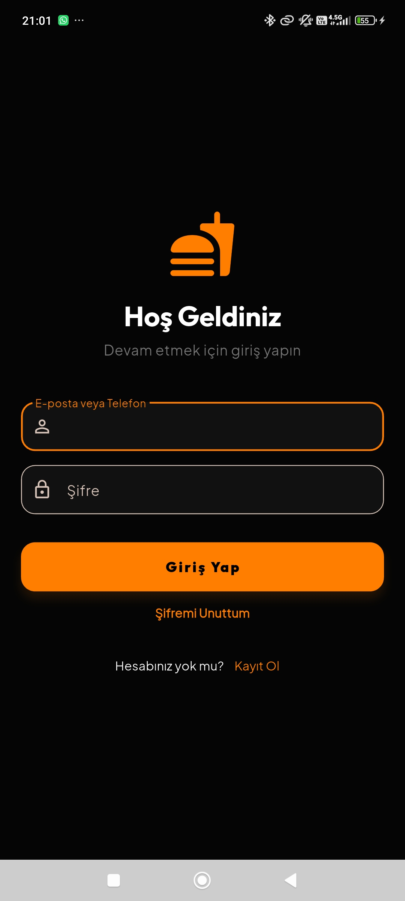
          <br><sub><b>📝 Güvenli Erişim</b></sub>
        </td>
        <td align="center" style="border: 4px solid #FF0000 !important; padding: 10px; vertical-align: top;">
          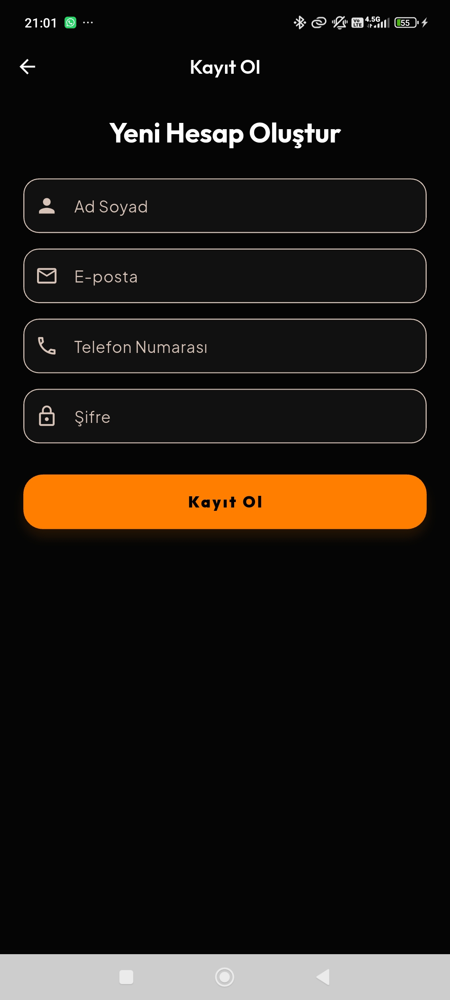
          <br><sub><b>👤 Kayıt Sistemi</b></sub>
        </td>
        <td align="center" style="border: 4px solid #FF0000 !important; padding: 10px; vertical-align: top;">
          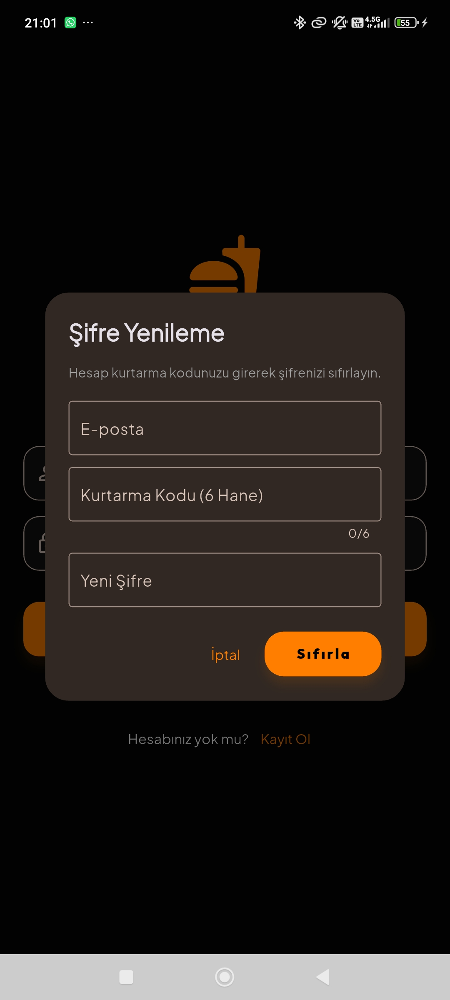
          <br><sub><b>🔐 Akıllı Sepet</b></sub>
        </td>
        <td align="center" style="border: 4px solid #FF0000 !important; padding: 10px; vertical-align: top;">
          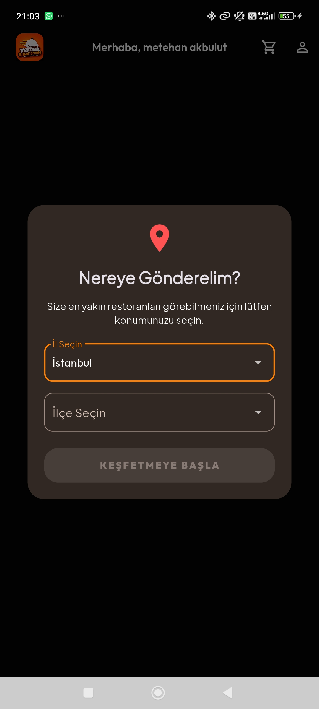
          <br><sub><b>👤 Kişisel Profil</b></sub>
        </td>
      </tr>
      <!-- Satır 2 -->
      <tr style="border: 4px solid #FF0000 !important; background-color: transparent !important;">
        <td align="center" style="border: 4px solid #FF0000 !important; padding: 10px; vertical-align: top;">
          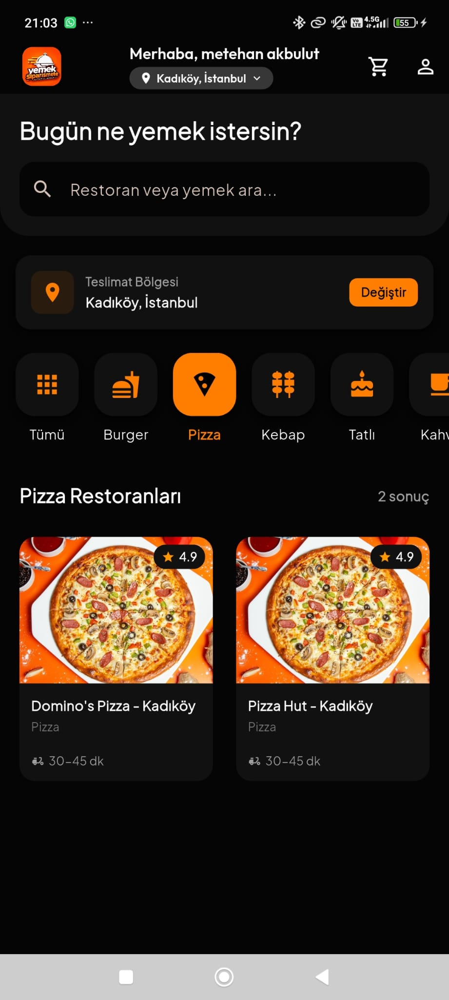
          <br><sub><b>🍕 Pizza Kategorisi</b></sub>
        </td>
        <td align="center" style="border: 4px solid #FF0000 !important; padding: 10px; vertical-align: top;">
          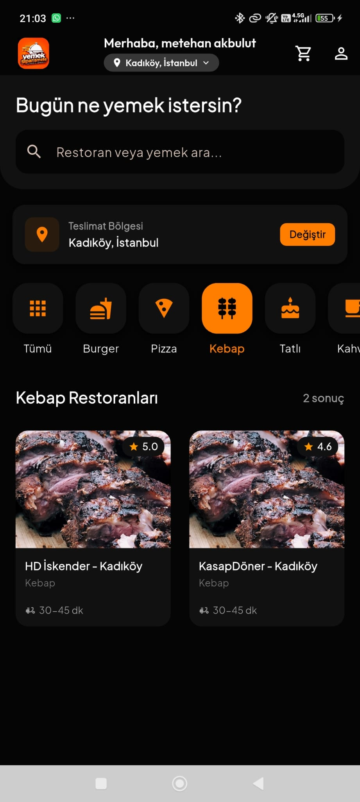
          <br><sub><b>🍢 Kebap Dünyası</b></sub>
        </td>
        <td align="center" style="border: 4px solid #FF0000 !important; padding: 10px; vertical-align: top;">
          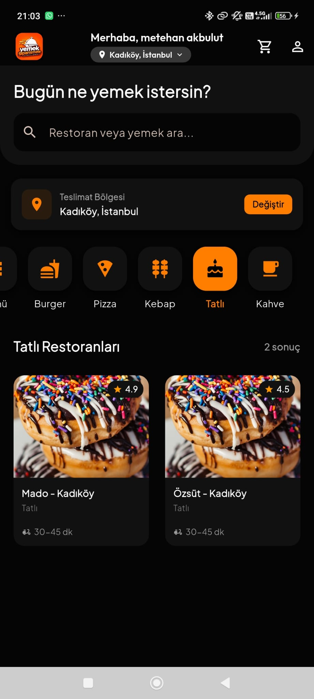
          <br><sub><b>🍰 Tatlı Menüsü</b></sub>
        </td>
        <td align="center" style="border: 4px solid #FF0000 !important; padding: 10px; vertical-align: top;">
          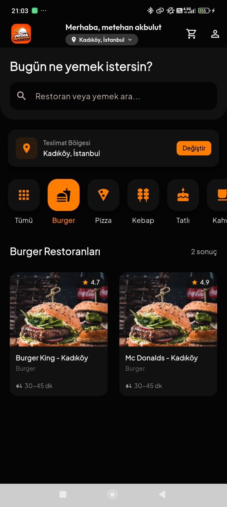
          <br><sub><b>🍔 Burger Seçenekleri</b></sub>
        </td>
      </tr>
      <!-- Satır 3 -->
      <tr style="border: 4px solid #FF0000 !important; background-color: transparent !important;">
        <td align="center" style="border: 4px solid #FF0000 !important; padding: 10px; vertical-align: top;">
          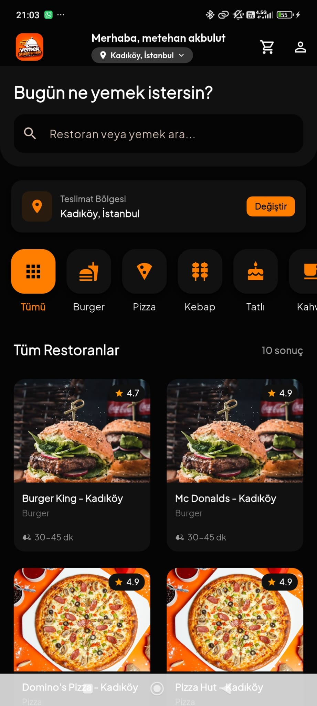
          <br><sub><b>🏠 Mobil Dashboard</b></sub>
        </td>
        <td align="center" style="border: 4px solid #FF0000 !important; padding: 10px; vertical-align: top;">
          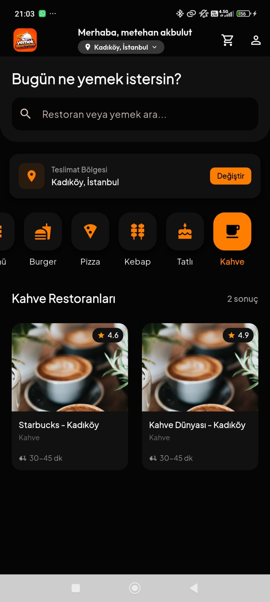
          <br><sub><b>☕ Kahveler</b></sub>
        </td>
        <td align="center" style="border: 4px solid #FF0000 !important; padding: 10px; vertical-align: top;">
          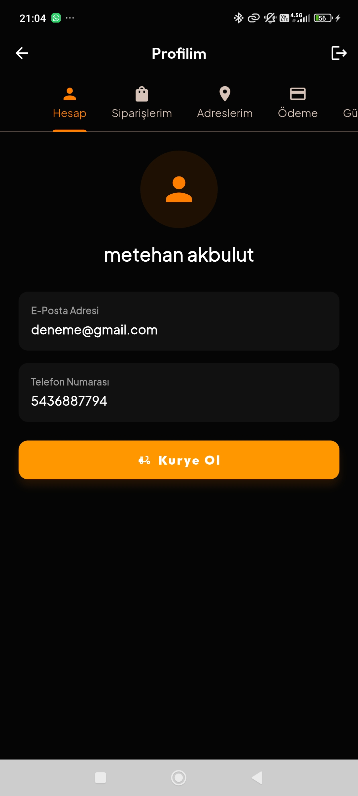
          <br><sub><b>👤 Kullanıcı Profili</b></sub>
        </td>
        <td align="center" style="border: 4px solid #FF0000 !important; padding: 10px; vertical-align: top;">
          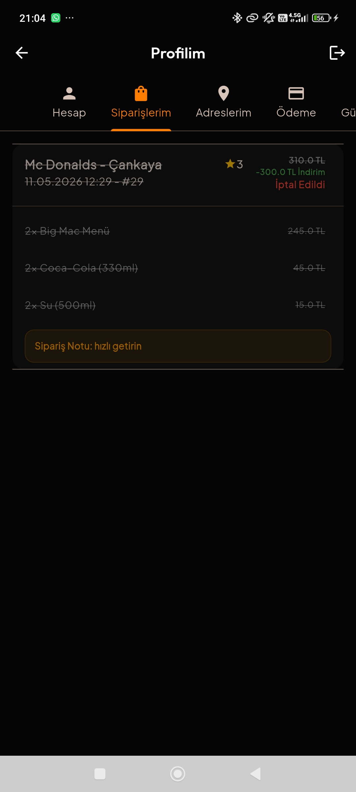
          <br><sub><b>📦 Sipariş Geçmişi</b></sub>
        </td>
      </tr>
      <!-- Satır 4 -->
      <tr style="border: 4px solid #FF0000 !important; background-color: transparent !important;">
        <td align="center" style="border: 4px solid #FF0000 !important; padding: 10px; vertical-align: top;">
          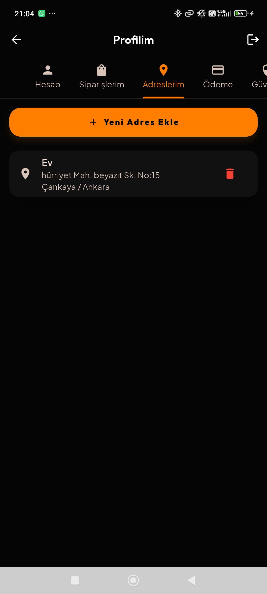
          <br><sub><b>📍 Adres Yönetimi</b></sub>
        </td>
        <td align="center" style="border: 4px solid #FF0000 !important; padding: 10px; vertical-align: top;">
          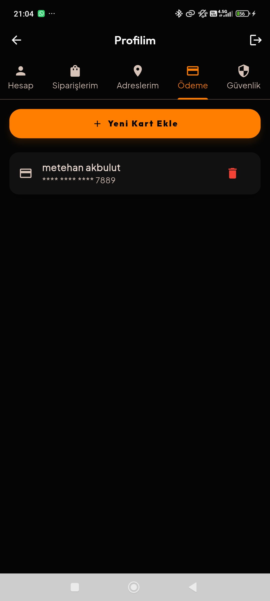
          <br><sub><b>💳 Ödeme Seçenekleri</b></sub>
        </td>
        <td align="center" style="border: 4px solid #FF0000 !important; padding: 10px; vertical-align: top;">
          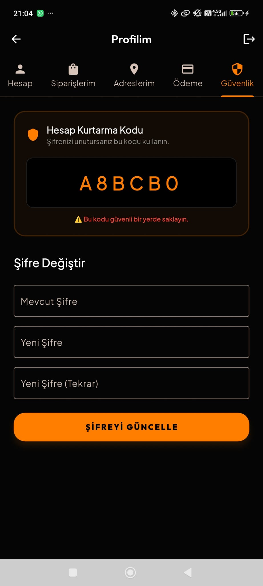
          <br><sub><b>🔒 Güvenlik Ayarları</b></sub>
        </td>
        <td align="center" style="border: 4px solid #FF0000 !important; padding: 10px; vertical-align: top;">
          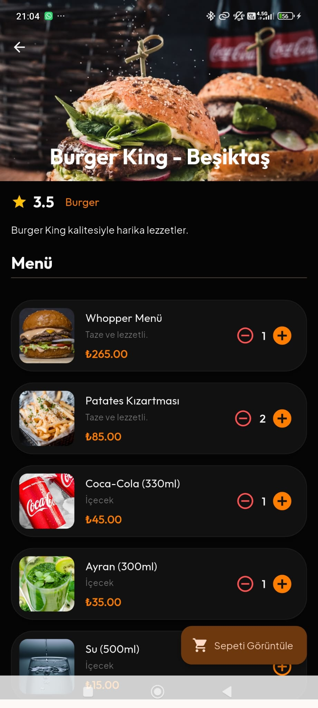
          <br><sub><b>Store Detayı</b></sub>
        </td>
      </tr>
      <!-- Satır 5 -->
      <tr style="border: 4px solid #FF0000 !important; background-color: transparent !important;">
        <td align="center" style="border: 4px solid #FF0000 !important; padding: 10px; vertical-align: top;">
          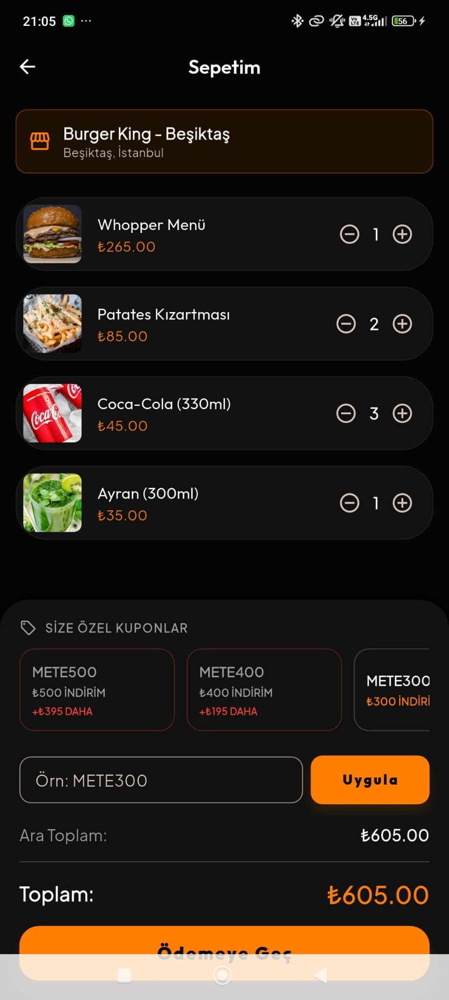
          <br><sub><b>🛒 Sepet & Fırsatlar</b></sub>
        </td>
        <td align="center" style="border: 4px solid #FF0000 !important; padding: 10px; vertical-align: top;">
          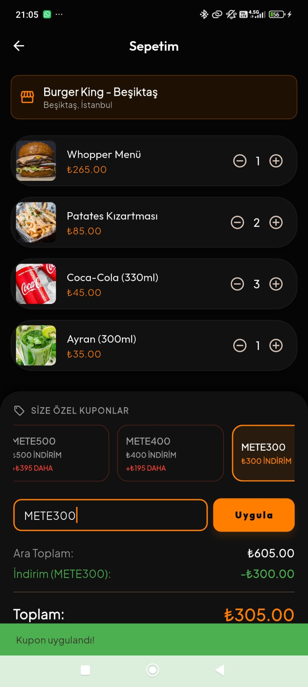
          <br><sub><b>🎫 Kupon Uygulama</b></sub>
        </td>
        <td align="center" style="border: 4px solid #FF0000 !important; padding: 10px; vertical-align: top;">
          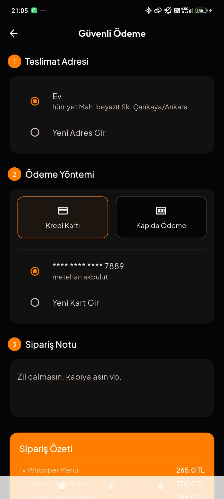
          <br><sub><b>💳 Ödeme Onayı</b></sub>
        </td>
        <td align="center" style="border: 4px solid #FF0000 !important; padding: 10px; vertical-align: top;">
          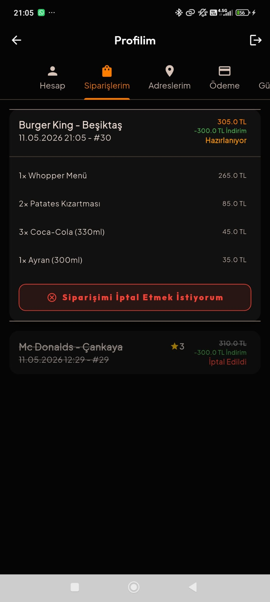
          <br><sub><b>🔄 Sipariş Süreci</b></sub>
        </td>
      </tr>
      <!-- Satır 6 -->
      <tr style="border: 4px solid #FF0000 !important; background-color: transparent !important;">
        <td align="center" style="border: 4px solid #FF0000 !important; padding: 10px; vertical-align: top;">
          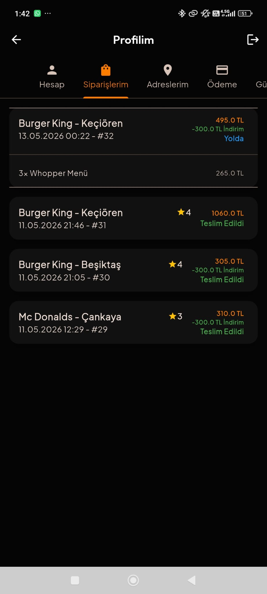
          <br><sub><b>🛵 Kurye Yolda</b></sub>
        </td>
        <td align="center" style="border: 4px solid #FF0000 !important; padding: 10px; vertical-align: top;">
          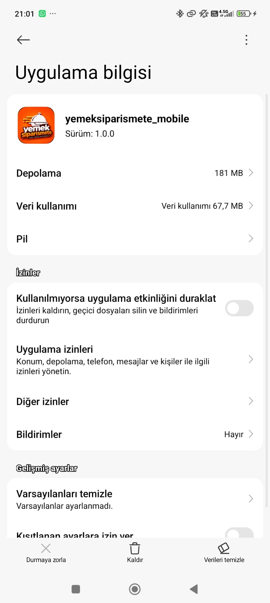
          <br><sub><b>📱 Uygulama Görünümü</b></sub>
        </td>
        <td align="center" style="border: 4px solid #FF0000 !important; padding: 10px; vertical-align: top;">
          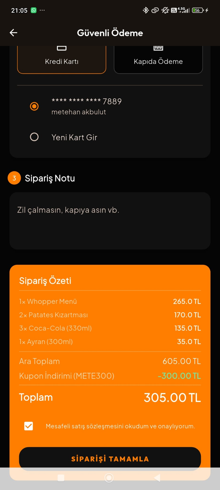
          <br><sub><b>✅ İşlem Başarılı</b></sub>
        </td>
        <td align="center" style="border: 4px solid #FF0000 !important; padding: 10px; vertical-align: top;">
          
          <br><sub><b>🔄 Sipariş Akışı</b></sub>
        </td>
      </tr>
    </tbody>
  </table>
</div>
<br>
<div align="center">
  <table style="width: 100%; table-layout: fixed; border-collapse: collapse !important; border: 4px solid #FF0000 !important;">
    <thead>
      <tr style="border: 4px solid #FF0000 !important; background-color: transparent !important;">
        <th colspan="4" align="center" style="border: 4px solid #FF0000 !important; padding: 20px 0;">
          <h3>⚙️ Mobil Admin Yönetim Paneli</h3>
        </th>
      </tr>
    </thead>
    <tbody>
      <tr style="border: 4px solid #FF0000 !important; background-color: transparent !important;">
        <td align="center" style="border: 4px solid #FF0000 !important; padding: 10px; vertical-align: top;">
          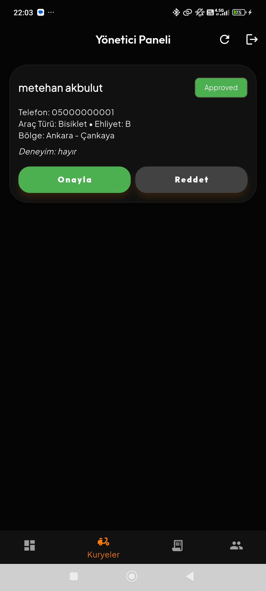
          <br><sub><b>🛵 Kurye Yönetimi</b></sub>
        </td>
        <td align="center" style="border: 4px solid #FF0000 !important; padding: 10px; vertical-align: top;">
          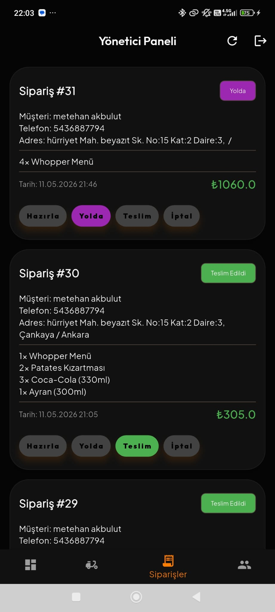
          <br><sub><b>📝 Sipariş Listesi</b></sub>
        </td>
        <td align="center" style="border: 4px solid #FF0000 !important; padding: 10px; vertical-align: top;">
          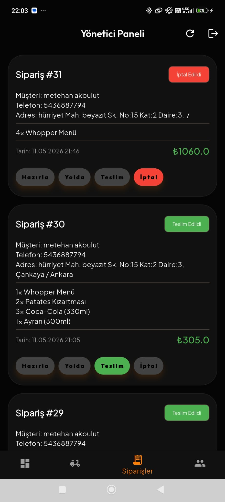
          <br><sub><b>❌ İptal Prosedürü</b></sub>
        </td>
        <td align="center" style="border: 4px solid #FF0000 !important; padding: 10px; vertical-align: top;">
          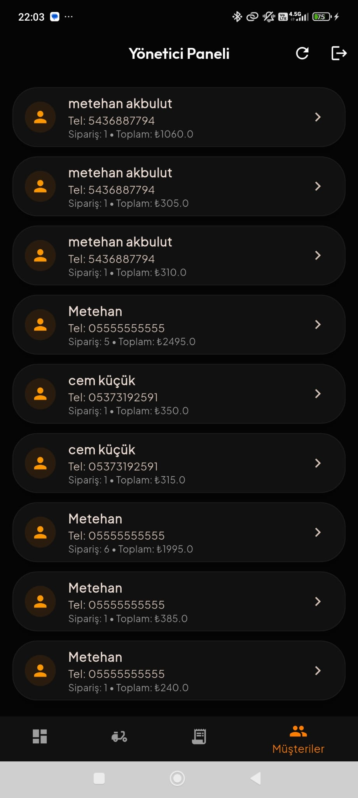
          <br><sub><b>👥 Müşteri Rehberi</b></sub>
        </td>
      </tr>
    </tbody>
  </table>
</div>
<br>
<div align="center">
  <table style="width: 100%; table-layout: fixed; border-collapse: collapse !important; border: 4px solid #FF0000 !important;">
    <thead>
      <tr style="border: 4px solid #FF0000 !important; background-color: transparent !important;">
        <th colspan="4" align="center" style="border: 4px solid #FF0000 !important; padding: 20px 0;">
          <h3>⚙️ Mobil Restaurant Yönetim Paneli</h3>
        </th>
      </tr>
    </thead>
    <tbody>
      <tr style="border: 4px solid #FF0000 !important; background-color: transparent !important;">
        <td align="center" style="border: 4px solid #FF0000 !important; padding: 10px; vertical-align: top;">
          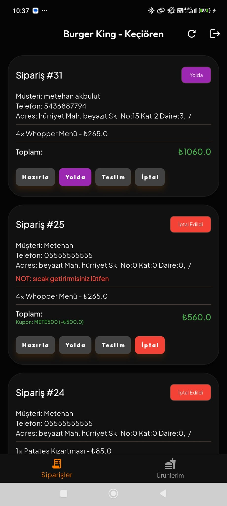
          <br><sub><b>📋 Mobil Siparişler</b></sub>
        </td>
        <td align="center" style="border: 4px solid #FF0000 !important; padding: 10px; vertical-align: top;">
          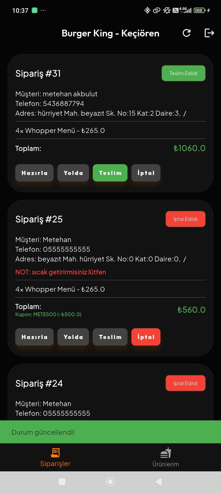
          <br><sub><b>✅ Teslimat Kontrol</b></sub>
        </td>
        <td align="center" style="border: 4px solid #FF0000 !important; padding: 10px; vertical-align: top;">
          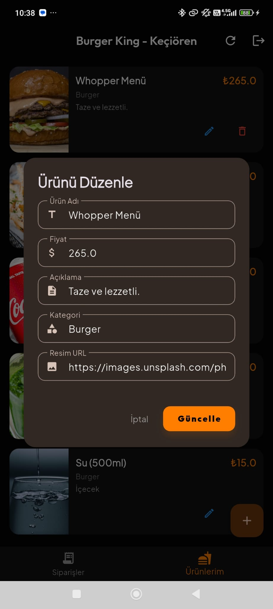
          <br><sub><b>✏️ Ürün Düzenleme</b></sub>
        </td>
        <td align="center" style="border: 4px solid #FF0000 !important; padding: 10px; vertical-align: top;">
          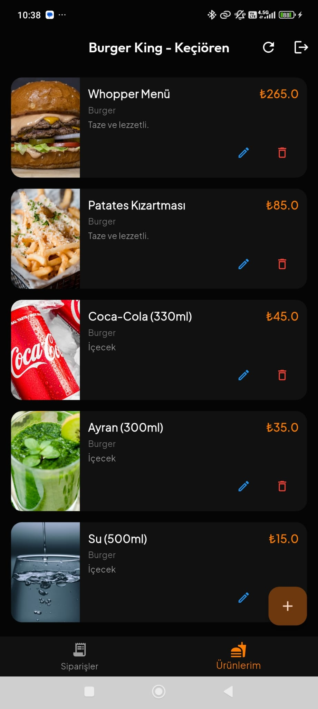
          <br><sub><b>🍔 Ürün Yönetimi</b></sub>
        </td>
      </tr>
    </tbody>
  </table>
</div>
<br>
<div align="center">
  <table style="width: 100%; table-layout: fixed; border-collapse: collapse !important; border: 4px solid #FF0000 !important;">
    <thead>
      <tr style="border: 4px solid #FF0000 !important; background-color: transparent !important;">
        <th colspan="4" align="center" style="border: 4px solid #FF0000 !important; padding: 20px 0;">
          <h3>📱 Mobil Kurye Yönetim Paneli</h3>
        </th>
      </tr>
    </thead>
    <tbody>
      <tr style="border: 4px solid #FF0000 !important; background-color: transparent !important;">
        <td align="center" style="border: 4px solid #FF0000 !important; padding: 10px; vertical-align: top;">
          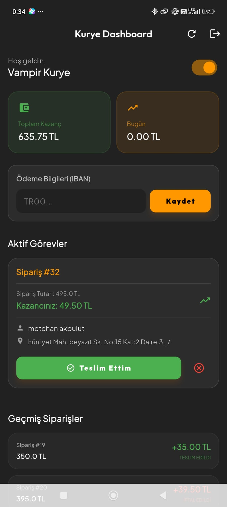
          <br><sub><b>📊 Kurye Ana Ekran</b></sub>
        </td>
        <td align="center" style="border: 4px solid #FF0000 !important; padding: 10px; vertical-align: top;">
          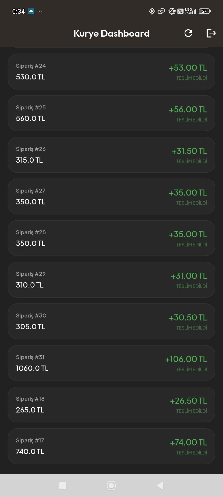
          <br><sub><b>📦 Teslimat Geçmişi</b></sub>
        </td>
        <td align="center" style="border: 4px solid #FF0000 !important; padding: 10px; vertical-align: top;">
          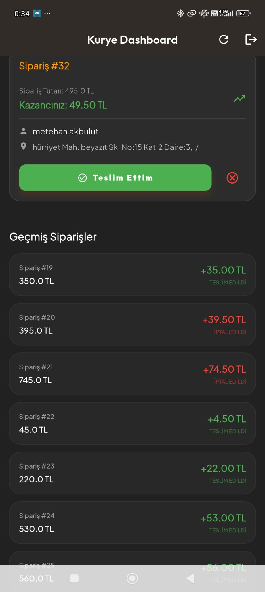
          <br><sub><b>❌ İptal Edilenler</b></sub>
        </td>
        <td align="center" style="border: 4px solid #FF0000 !important; padding: 10px; vertical-align: top;">
          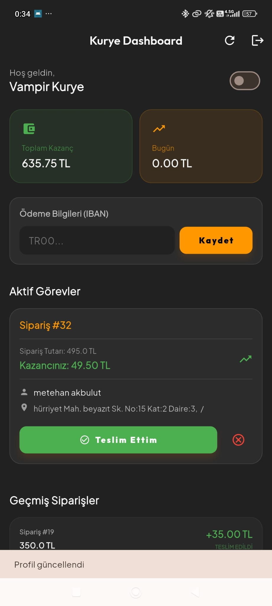
          <br><sub><b>💳 Aktif Sipariş & IBAN</b></sub>
        </td>
      </tr>
    </tbody>
  </table>
</div>
<br>
<div align="center">
  <table style="width: 100%; table-layout: fixed; border-collapse: collapse !important; border: 4px solid #FF0000 !important;">
    <thead>
      <tr style="border: 4px solid #FF0000 !important; background-color: transparent !important;">
        <th colspan="4" align="center" style="border: 4px solid #FF0000 !important; padding: 20px 0;">
          <h3>📱 Mobil Sosyal Etkileşim & Dashboard</h3>
        </th>
      </tr>
    </thead>
    <tbody>
      <tr style="border: 4px solid #FF0000 !important; background-color: transparent !important;">
        <td align="center" style="border: 4px solid #FF0000 !important; padding: 10px; vertical-align: top;">
          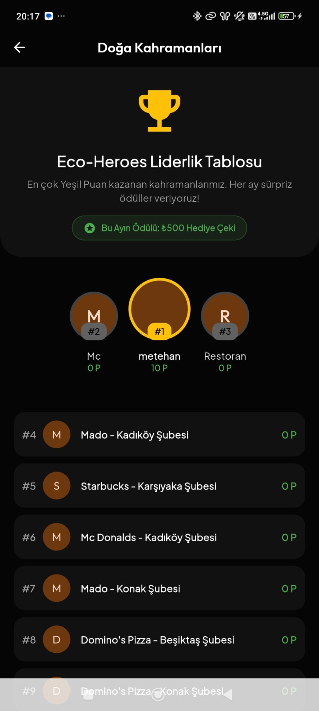
          <br><sub><b>🌿 Çevre Dostu Sıralama</b></sub>
        </td>
        <td align="center" style="border: 4px solid #FF0000 !important; padding: 10px; vertical-align: top;">
          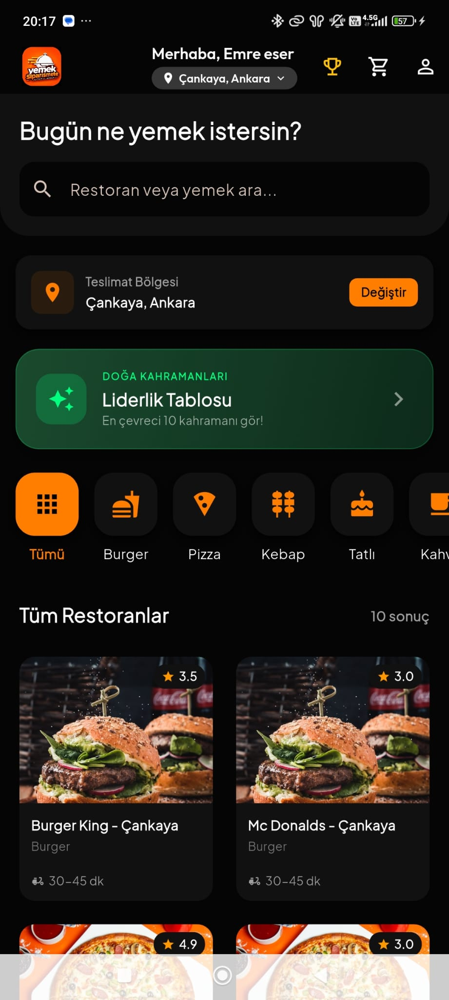
          <br><sub><b>🏠 Yeni Dashboard</b></sub>
        </td>
        <td align="center" style="border: 4px solid #FF0000 !important; padding: 10px; vertical-align: top;">
          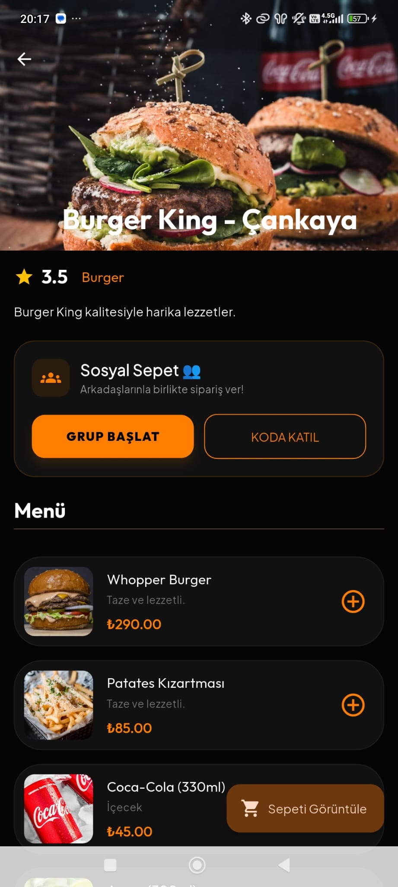
          <br><sub><b>💬 Sosyal Sepet Paneli</b></sub>
        </td>
        <td align="center" style="border: 4px solid #FF0000 !important; padding: 10px; vertical-align: top;">
          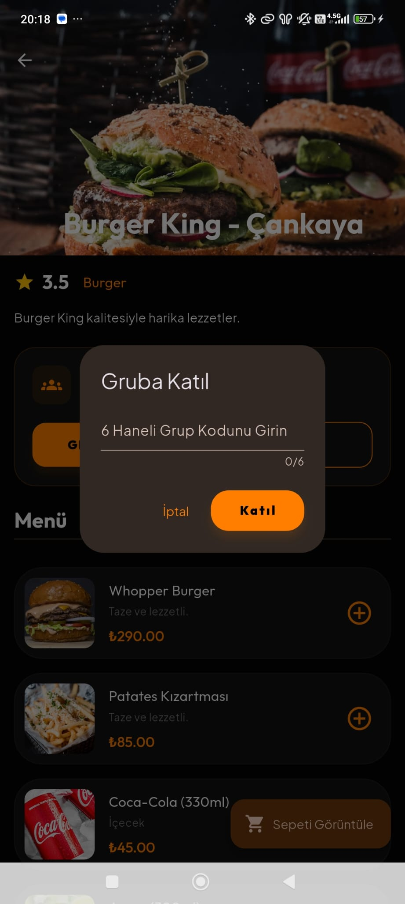
          <br><sub><b>🔑 Ortak Sipariş Kodu</b></sub>
        </td>
      </tr>
    </tbody>
  </table>
</div>
<br>
<div align="center">
  <table style="width: 100%; table-layout: fixed; border-collapse: collapse !important; border: 4px solid #FF0000 !important;">
    <thead>
      <tr style="border: 4px solid #FF0000 !important; background-color: transparent !important;">
        <th colspan="4" align="center" style="border: 4px solid #FF0000 !important; padding: 20px 0;">
          <h3>🛍️ Mobil Sepet & Grup Sipariş Süreçleri</h3>
        </th>
      </tr>
    </thead>
    <tbody>
      <tr style="border: 4px solid #FF0000 !important; background-color: transparent !important;">
        <td align="center" style="border: 4px solid #FF0000 !important; padding: 10px; vertical-align: top;">
          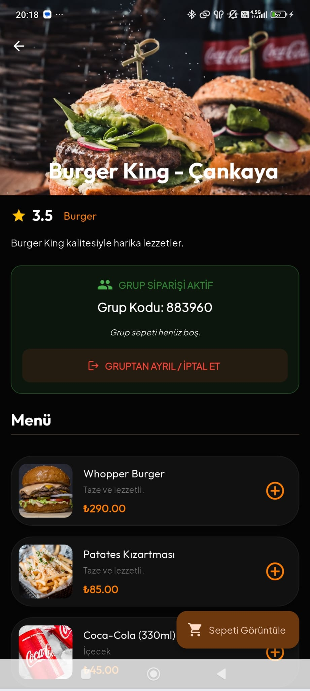
          <br><sub><b>✨ Aktif Sipariş Durumu</b></sub>
        </td>
        <td align="center" style="border: 4px solid #FF0000 !important; padding: 10px; vertical-align: top;">
          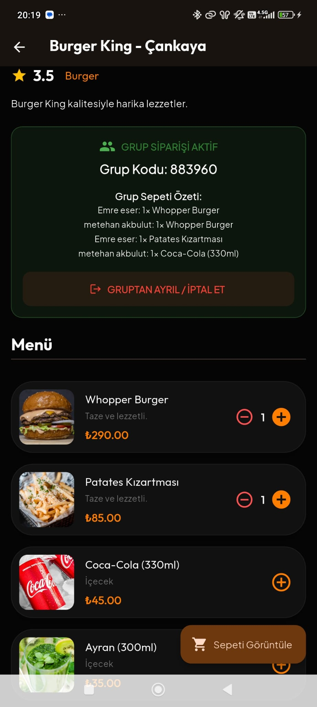
          <br><sub><b>➕ Ürün Ekleme & Sepet</b></sub>
        </td>
        <td align="center" style="border: 4px solid #FF0000 !important; padding: 10px; vertical-align: top;">
          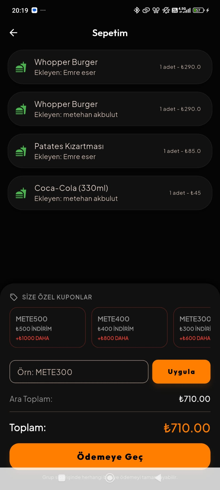
          <br><sub><b>🛒 Ortak Sepet Detayı</b></sub>
        </td>
        <td align="center" style="border: 4px solid #FF0000 !important; padding: 10px; vertical-align: top;">
          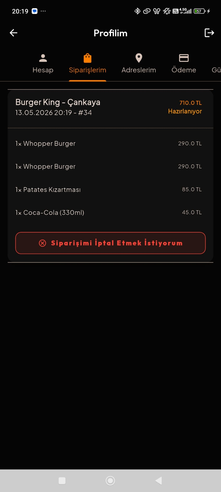
          <br><sub><b>📂 Sipariş Geçmişim</b></sub>
        </td>
      </tr>
    </tbody>
  </table>
</div>
<br>
<div align="center">
  <table style="width: 100%; table-layout: fixed; border-collapse: collapse !important; border: 4px solid #EAE8E1 !important;">
    <thead>
      <tr style="border: 4px solid #EAE8E1 !important; background-color: #E2E0D6 !important;">
        <th colspan="4" align="center" style="border: 4px solid #EAE8E1 !important; padding: 20px 0;">
          <h3 style="color: #4A4A4A; margin: 0; font-family: sans-serif;">📊 1. Bölüm: Veritabanı Temel Tanımlamaları</h3>
        </th>
      </tr>
    </thead>
    <tbody>
      <tr style="border: 4px solid #EAE8E1 !important; background-color: transparent !important;">
        <td align="center" style="border: 4px solid #EAE8E1 !important; padding: 15px; vertical-align: top;">
          
          <br><sub style="font-family: sans-serif; font-size: 12px; color: #4A4A4A; display: block; margin-top: 8px;"><b>📁 Kullanicilarsql</b></sub>
        </td>
        <td align="center" style="border: 4px solid #EAE8E1 !important; padding: 15px; vertical-align: top;">
          
          <br><sub style="font-family: sans-serif; font-size: 12px; color: #4A4A4A; display: block; margin-top: 8px;"><b>📁 Kullanicilarsql2</b></sub>
        </td>
        <td align="center" style="border: 4px solid #EAE8E1 !important; padding: 15px; vertical-align: top;">
          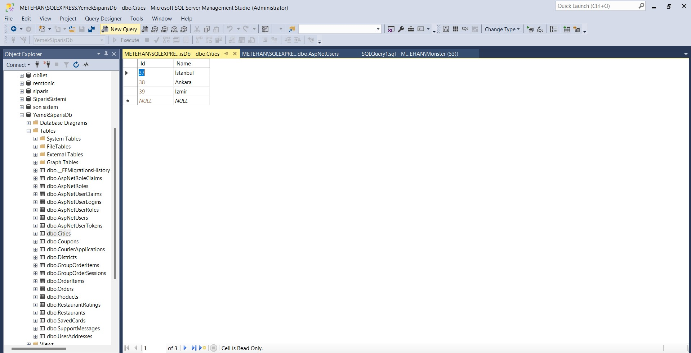
          <br><sub style="font-family: sans-serif; font-size: 12px; color: #4A4A4A; display: block; margin-top: 8px;"><b>📁 sehirlersql</b></sub>
        </td>
        <td align="center" style="border: 4px solid #EAE8E1 !important; padding: 15px; vertical-align: top;">
          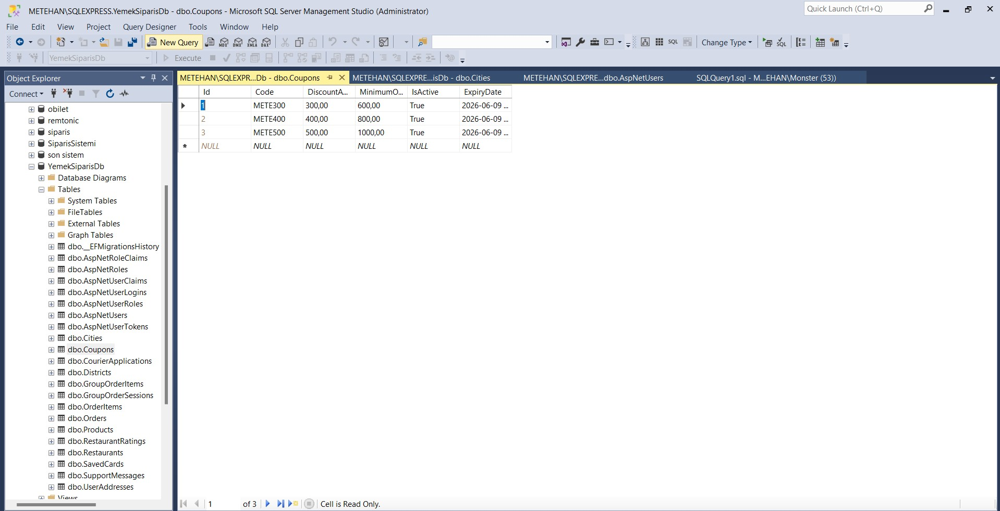
          <br><sub style="font-family: sans-serif; font-size: 12px; color: #4A4A4A; display: block; margin-top: 8px;"><b>📁 kuponlarsql</b></sub>
        </td>
      </tr>
    </tbody>
  </table>
</div>
<br>
<div align="center" style="margin-top: 25px;">
  <table style="width: 100%; table-layout: fixed; border-collapse: collapse !important; border: 4px solid #EAE8E1 !important;">
    <thead>
      <tr style="border: 4px solid #EAE8E1 !important; background-color: #E2E0D6 !important;">
        <th colspan="4" align="center" style="border: 4px solid #EAE8E1 !important; padding: 20px 0;">
          <h3 style="color: #4A4A4A; margin: 0; font-family: sans-serif;">📊 2. Bölüm: Operasyonel Kontroller ve Sipariş Yönetimi</h3>
        </th>
      </tr>
    </thead>
    <tbody>
      <tr style="border: 4px solid #EAE8E1 !important; background-color: transparent !important;">
        <td align="center" style="border: 4px solid #EAE8E1 !important; padding: 15px; vertical-align: top;">
          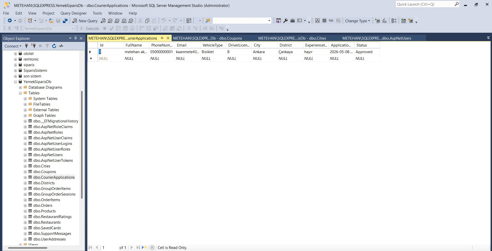
          <br><sub style="font-family: sans-serif; font-size: 12px; color: #4A4A4A; display: block; margin-top: 8px;"><b>📁 kuryekontrolsql</b></sub>
        </td>
        <td align="center" style="border: 4px solid #EAE8E1 !important; padding: 15px; vertical-align: top;">
          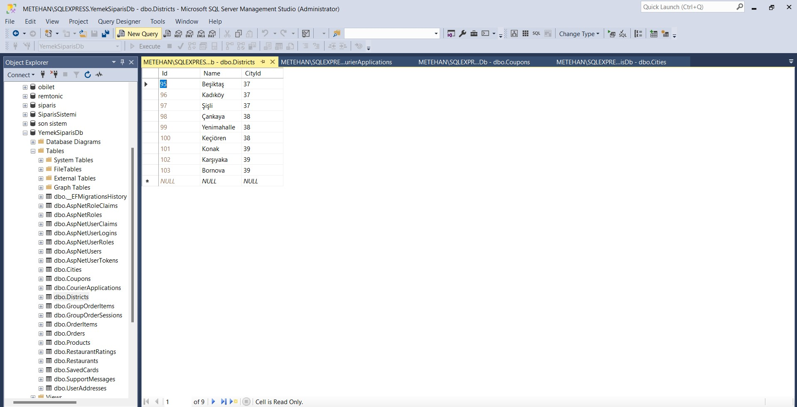
          <br><sub style="font-family: sans-serif; font-size: 12px; color: #4A4A4A; display: block; margin-top: 8px;"><b>📁 ilcelersql</b></sub>
        </td>
        <td align="center" style="border: 4px solid #EAE8E1 !important; padding: 15px; vertical-align: top;">
          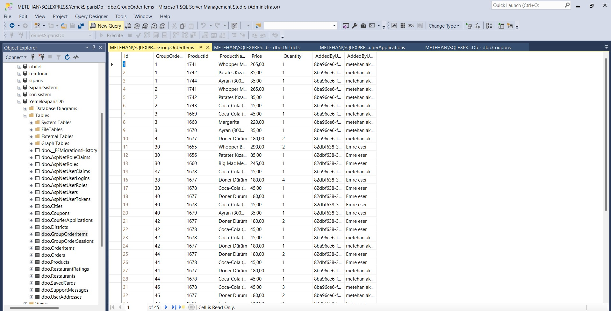
          <br><sub style="font-family: sans-serif; font-size: 12px; color: #4A4A4A; display: block; margin-top: 8px;"><b>📁 siparislersql</b></sub>
        </td>
        <td align="center" style="border: 4px solid #EAE8E1 !important; padding: 15px; vertical-align: top;">
          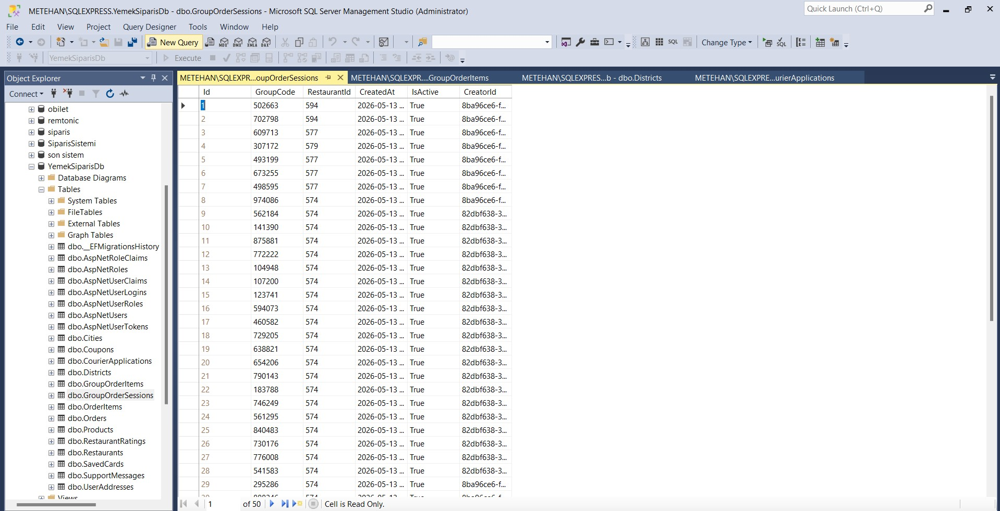
          <br><sub style="font-family: sans-serif; font-size: 12px; color: #4A4A4A; display: block; margin-top: 8px;"><b>📁 ortakgrupsql</b></sub>
        </td>
      </tr>
    </tbody>
  </table>
</div>
<br>
<div align="center" style="margin-top: 25px;">
  <table style="width: 100%; table-layout: fixed; border-collapse: collapse !important; border: 4px solid #EAE8E1 !important;">
    <thead>
      <tr style="border: 4px solid #EAE8E1 !important; background-color: #E2E0D6 !important;">
        <th colspan="4" align="center" style="border: 4px solid #EAE8E1 !important; padding: 20px 0;">
          <h3 style="color: #4A4A4A; margin: 0; font-family: sans-serif;">📊 3. Bölüm: Restoran Ürünleri ve Müşteri Sipariş İlişkileri</h3>
        </th>
      </tr>
    </thead>
    <tbody>
      <tr style="border: 4px solid #EAE8E1 !important; background-color: transparent !important;">
        <td align="center" style="border: 4px solid #EAE8E1 !important; padding: 15px; vertical-align: top;">
          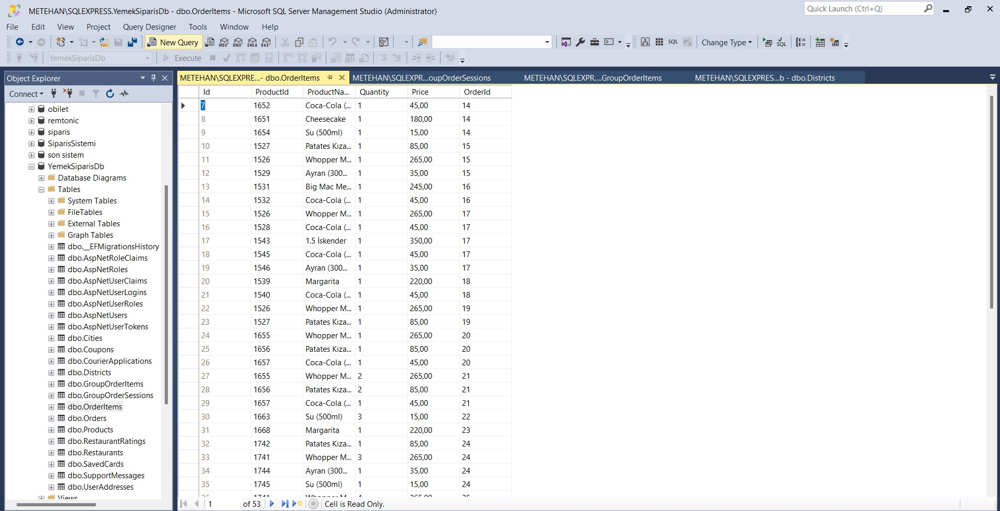
          <br><sub style="font-family: sans-serif; font-size: 12px; color: #4A4A4A; display: block; margin-top: 8px;"><b>📁 restauranturunsql</b></sub>
        </td>
        <td align="center" style="border: 4px solid #EAE8E1 !important; padding: 15px; vertical-align: top;">
          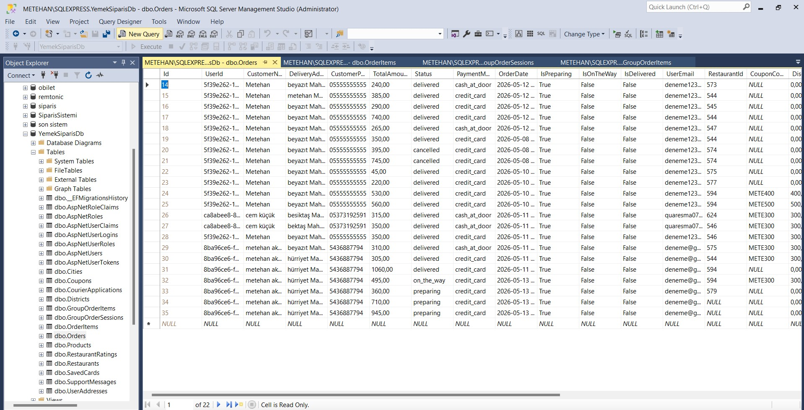
          <br><sub style="font-family: sans-serif; font-size: 12px; color: #4A4A4A; display: block; margin-top: 8px;"><b>📁 musterisql</b></sub>
        </td>
        <td align="center" style="border: 4px solid #EAE8E1 !important; padding: 15px; vertical-align: top;">
          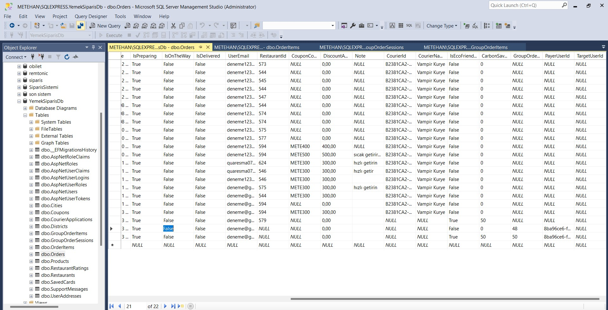
          <br><sub style="font-family: sans-serif; font-size: 12px; color: #4A4A4A; display: block; margin-top: 8px;"><b>📁 musterisiparis2</b></sub>
        </td>
        <td align="center" style="border: 4px solid #EAE8E1 !important; padding: 15px; vertical-align: top;">
          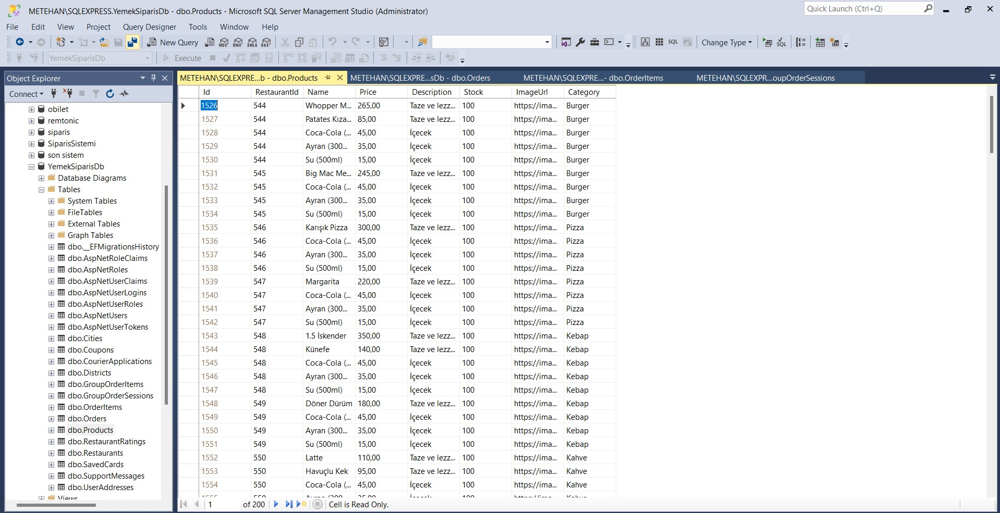
          <br><sub style="font-family: sans-serif; font-size: 12px; color: #4A4A4A; display: block; margin-top: 8px;"><b>📁 urunler2</b></sub>
        </td>
      </tr>
    </tbody>
  </table>
</div>
<br>
<div align="center" style="margin-top: 25px;">
  <table style="width: 100%; table-layout: fixed; border-collapse: collapse !important; border: 4px solid #EAE8E1 !important;">
    <thead>
      <tr style="border: 4px solid #EAE8E1 !important; background-color: #E2E0D6 !important;">
        <th colspan="4" align="center" style="border: 4px solid #EAE8E1 !important; padding: 20px 0;">
          <h3 style="color: #4A4A4A; margin: 0; font-family: sans-serif;">📊 4. Bölüm: Restoran Değerlendirmeleri ve Kullanıcı Kayıt Bilgileri</h3>
        </th>
      </tr>
    </thead>
    <tbody>
      <tr style="border: 4px solid #EAE8E1 !important; background-color: transparent !important;">
        <td align="center" style="border: 4px solid #EAE8E1 !important; padding: 15px; vertical-align: top;">
          
          <br><sub style="font-family: sans-serif; font-size: 12px; color: #4A4A4A; display: block; margin-top: 8px;"><b>📁 restaurantyildizsql</b></sub>
        </td>
        <td align="center" style="border: 4px solid #EAE8E1 !important; padding: 15px; vertical-align: top;">
          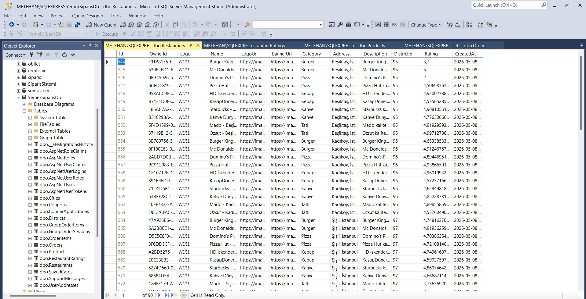
          <br><sub style="font-family: sans-serif; font-size: 12px; color: #4A4A4A; display: block; margin-top: 8px;"><b>📁 restaurantbilgilerisql</b></sub>
        </td>
        <td align="center" style="border: 4px solid #EAE8E1 !important; padding: 15px; vertical-align: top;">
          
          <br><sub style="font-family: sans-serif; font-size: 12px; color: #4A4A4A; display: block; margin-top: 8px;"><b>📁 ornekkartkaydisql</b></sub>
        </td>
        <td align="center" style="border: 4px solid #EAE8E1 !important; padding: 15px; vertical-align: top;">
          
          <br><sub style="font-family: sans-serif; font-size: 12px; color: #4A4A4A; display: block; margin-top: 8px;"><b>📁 ornekadreskayitsql</b></sub>
        </td>
      </tr>
    </tbody>
  </table>
</div>
<br>
<div align="center" style="margin-top: 25px;">
  <table style="width: 100%; table-layout: fixed; border-collapse: collapse !important; border: 4px solid #EAE8E1 !important;">
    <thead>
      <tr style="border: 4px solid #EAE8E1 !important; background-color: #E2E0D6 !important;">
        <th colspan="4" align="center" style="border: 4px solid #EAE8E1 !important; padding: 20px 0;">
          <h3 style="color: #4A4A4A; margin: 0; font-family: sans-serif;">📊 5. Bölüm: Rol Yönetimi ve Gelişmiş Fonksiyonlar</h3>
        </th>
      </tr>
    </thead>
    <tbody>
      <tr style="border: 4px solid #EAE8E1 !important; background-color: transparent !important;">
        <td align="center" style="border: 4px solid #EAE8E1 !important; padding: 15px; vertical-align: top;">
          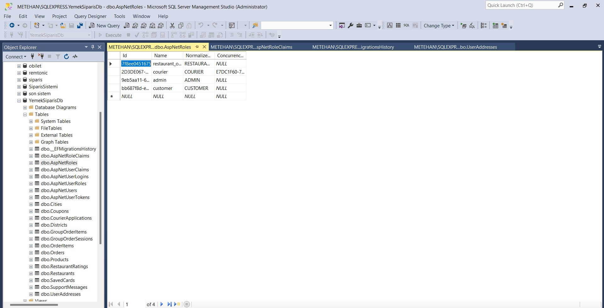
          <br><sub style="font-family: sans-serif; font-size: 12px; color: #4A4A4A; display: block; margin-top: 8px;"><b>📁 ornekrolsql</b></sub>
        </td>
        <td align="center" style="border: 4px solid #EAE8E1 !important; padding: 15px; vertical-align: top;">
          
          <br><sub style="font-family: sans-serif; font-size: 12px; color: #4A4A4A; display: block; margin-top: 8px;"><b>📁 rolatamalari</b></sub>
        </td>
        <td align="center" style="border: 4px solid #EAE8E1 !important; padding: 15px; vertical-align: top;">
          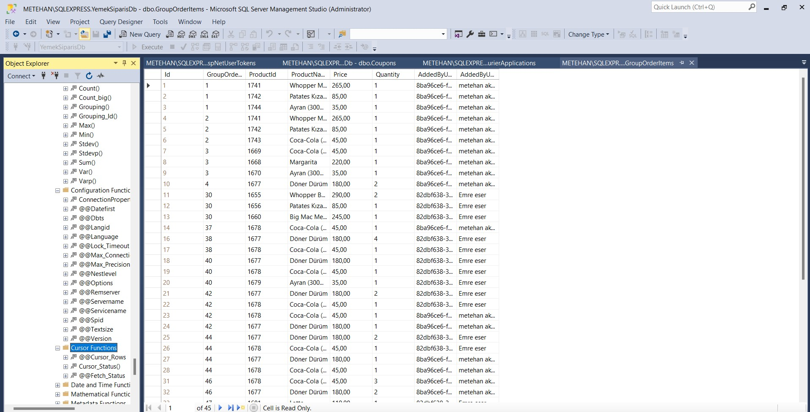
          <br><sub style="font-family: sans-serif; font-size: 12px; color: #4A4A4A; display: block; margin-top: 8px;"><b>📁 fonksiyondegiskensql</b></sub>
        </td>
        <td align="center" style="border: 4px solid #EAE8E1 !important; padding: 15px; vertical-align: top;">
          
          <br><sub style="font-family: sans-serif; font-size: 12px; color: #4A4A4A; display: block; margin-top: 8px;"><b>📁 devami</b></sub>
        </td>
      </tr>
    </tbody>
  </table>
</div>
<br>

