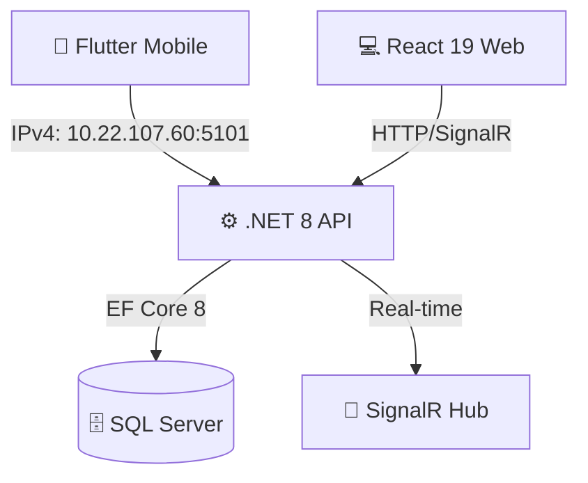

# 🍕 YemekSiparisMete: Gastronomi ve Teknolojinin Kusursuz Senfonisi

**YemekSiparisMete**, modern yazılım mimarilerinin tüm imkanları kullanılarak geliştirilmiş, uçtan uca bir yemek sipariş ve yönetim ekosistemidir. Bu proje; ölçeklenebilir bir Backend, estetik bir Web arayüzü ve yüksek performanslı bir Mobil uygulama üçlemesinden oluşmaktadır.

---

## 🏛️ 1. Mimari Şaheser: Sistem Topolojisi

Sistem, **N-Tier (Çok Katmanlı)** mimari prensiplerine sadık kalınarak, her bir bileşenin kendi sorumluluğunu (Separation of Concerns) taşıdığı bir yapıda kurgulanmıştır.

---

## ⚙️ 2. Backend Mühendisliği: Verimlilik ve Ölçeklenebilirlik

Sistemin kalbi olan backend tarafında, kurumsal düzeyde (enterprise-grade) teknolojiler kullanılarak sarsılmaz bir iş mantığı katmanı oluşturulmuştur.

| Teknoloji | Versiyon | Görev & Stratejik Avantaj |
| :--- | :--- | :--- |
| **Microsoft .NET Core** | 8.0 | Yüksek işlem kapasiteli, düşük gecikme süreli ana motor. |
| **Entity Framework Core** | 8.0 | Veritabanı yönetiminde nesne-tabanlı (ORM) esneklik. |
| **SQL Server** | Enterprise | ACID prensiplerine tam uyumlu, güvenilir veri depolama. |
| **SignalR** | Real-Time | Mutfak ve müşteri arasında kesintisiz canlı veri akışı. |
| **ASP.NET Identity** | JWT | Role-based (Rol tabanlı) kriptografik güvenlik sistemi. |

---

## 🗄️ 3. Veritabanı ve Veri Yönetimi (SQL Server)

Projenin veri ambarı, **Microsoft SQL Server** üzerinde optimize edilmiştir. Veri bütünlüğü (integrity) ve ilişkisel modelleme (relational mapping) en üst seviyededir.

*   **İlişkisel Mimari:** Müşteriler, Restoranlar, Ürünler, Siparişler ve Kuryeler arasındaki karmaşık bağlar, verimli `Join` operasyonları ve indeksleme stratejileriyle yönetilir.
*   **Veri Güvenliği:** Tüm hassas veriler, uygulama katmanında normalize edildikten sonra SQL Server'ın güvenli havuzuna aktarılır.
*   **Hızlı Kurulum:** Proje içerisinde bulunan `YemekSiparisDb_Yedek.sql` dosyası ile saniyeler içinde tüm şema ve test verileri ayağa kaldırılabilir.

---

## 🌐 4. Ağ Topolojisi ve IPv4 Erişim Dinamikleri

Çapraz platform (Cross-platform) haberleşmesi, sistemin en güçlü yanlarından biridir. Mobil ve Web istemcilerinin merkezi sunucuyla sorunsuz etkileşimi için özel bir ağ yapılandırması uygulanmıştır.

> [!IMPORTANT]
> **IPv4 Bağlantı Yapılandırması:**
> Fiziksel cihazlar ve mobil emülatörlerin sunucuya erişebilmesi için Backend API, statik IPv4 adresi üzerinden yayın yapmaktadır.
> - **Sunucu IPv4 Adresi:** `10.22.107.60`
> - **Dinleme Portu:** `5101`
> - **Protokol:** HTTP/REST & WebSockets (SignalR)

Bu yapılandırma, `localhost` sınırlarını aşarak gerçek dünya ağ senaryolarında (Physical Device Testing) projenin kesintisiz çalışmasını garanti altına alır.

---

## 🎨 5. Web Frontend: Estetik ve Fonksiyonelliğin Senfonisi

Web arayüzü, **React 19** ve modern CSS teknikleriyle tasarlanmış, kullanıcı deneyimini (UX) odağına alan bir görsel şölen sunar.

| Bileşen | Teknolojik Derinlik | Stratejik Avantaj |
| :--- | :--- | :--- |
| **React 19** | Latest Release | Modern rendering ve üstün component hiyerarşisi. |
| **Vite Engine** | Ultra Fast | Saniyeler içinde yüklenen sayfalar ve optimize bundle. |
| **TypeScript** | Type-Safe | Çalışma zamanı hatalarını sıfıra indiren güçlü kod yapısı. |
| **Framer Motion** | 3D & Glass | 3D hover efektleri ve premium cam efekti (Glassmorphism). |

---

## 📲 6. Mobil Teknoloji: Avucunuzdaki Hız ve Zarafet

Flutter ile inşa edilen mobil uygulama, native performansını şık bir tasarım diliyle birleştirir.

| Özellik | Detay | Kullanıcı Deneyimi (UX) |
| :--- | :--- | :--- |
| **Flutter / Dart** | Reaktif Mimari | Takılmayan, 60 FPS akıcılığında ekran geçişleri. |
| **Provider** | State Management | Verilerin cihaz hafızasında anlık ve tutarlı yönetimi. |
| **Material 3** | Tasarım Dili | Modern, temiz ve göz yormayan profesyonel arayüz. |
| **API Sync** | Optimized HTTP | Düşük internet hızına sahip ortamlarda bile kararlı veri alışverişi. |

---

## 🔐 7. Siber Güvenlik: Kırılmaz Bir Dijital Kale

Kullanıcı verileri, en modern siber güvenlik standartları ile korunmaktadır:

1.  **Parola Güvenliği:** `PBKDF2` hashing algoritması ile binlerce kez tekrarlanmış tuzlama (salting) işlemi.
2.  **Yetkilendirme:** `JWT (JSON Web Token)` ile stateless ve güvenli oturum yönetimi.
3.  **Veri Validasyonu:** `Fluent Validation` ile backend tarafında enjekte edilen katı veri doğrulama kuralları.

---

## 🌟 Sonuç

**YemekSiparisMete**, sadece bir ödev veya hobi projesi değil; SQL Server'ın derinliklerinden React 19'un en güncel özelliklerine, IPv4 tabanlı hibrit ağ mimarisinden Flutter'ın performansına kadar her noktası titizlikle işlenmiş profesyonel bir **yazılım ekosistemidir**.

---
*Hazırlayan: **Mete*** 🚀
*Teknoloji Yığını: .NET 8, React 19, Flutter, SQL Server*
