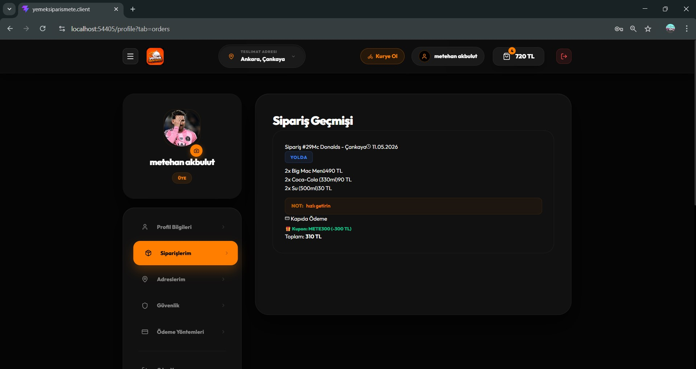

  <table style="width: 100%; table-layout: fixed; border-collapse: collapse; border: none !important;">
    <tr style="border: none !important; background: transparent !important;">
      <td align="center" style="border: none !important; padding: 10px; vertical-align: top;">
        
         <b>📍 Bölge Filtreleme</b>
      </td>
      <td align="center" style="border: none !important; padding: 10px; vertical-align: top;">
        
         <b>🏠 Ana Dashboard</b>
      </td>
      <td align="center" style="border: none !important; padding: 10px; vertical-align: top;">
        
         <b>🍴 Restoran Katalog</b>
      </td>
      <td align="center" style="border: none !important; padding: 10px; vertical-align: top;">
        
         <b>🔍 Akıllı Arama</b>
      </td>
    </tr>
    <tr style="border: none !important; background: transparent !important;">
      <td align="center" style="border: none !important; padding: 10px; vertical-align: top;">
        
         <b>🍕 Pizza Dünyası</b>
      </td>
      <td align="center" style="border: none !important; padding: 10px; vertical-align: top;">
        
         <b>🍢 Kebap Kültürü</b>
      </td>
      <td align="center" style="border: none !important; padding: 10px; vertical-align: top;">
        
         <b>🍰 Tatlı Serüveni</b>
      </td>
      <td align="center" style="border: none !important; padding: 10px; vertical-align: top;">
        
         <b>☕ Kahve & İçecek</b>
        <tr style="border: none !important; background: transparent !important;">
      <td align="center" style="border: none !important; padding: 10px; vertical-align: top;">
        
         <b>🏪 Örnek Restaurant</b>
      </td>
      <td align="center" style="border: none !important; padding: 10px; vertical-align: top;">
        
         <b>🍔 Örnek Ürünler</b>
      </td>
      <td align="center" style="border: none !important; padding: 10px; vertical-align: top;">
        
         <b>🛒 Örnek Sepet Gösterimi</b>
      </td>
      <td align="center" style="border: none !important; padding: 10px; vertical-align: top;">
        
         <b>📄 Bilgi & Footer</b>
        <tr style="border: none !important; background: transparent !important;">
      <td align="center" style="border: none !important; padding: 10px; vertical-align: top;">
        
         <b>📱 Yan Menü Navigasyon</b>
      </td>
      <td align="center" style="border: none !important; padding: 10px; vertical-align: top;">
        
         <b>🚲 Kurye Başvuru Sistemi</b>
      </td>
      <td align="center" style="border: none !important; padding: 10px; vertical-align: top;">
        
         <b>ℹ️Hakkında</b>
      </td>
      <td align="center" style="border: none !important; padding: 10px; vertical-align: top;">
        
         <b>ℹ️Hakkında Devam</b>
      </td>
    </tr>
      <tr style="border: none !important; background: transparent !important;">
      <td align="center" style="border: none !important; padding: 10px; vertical-align: top;">
        
         <b>🔐 Kullanıcı Girişi</b>
      </td>
      <td align="center" style="border: none !important; padding: 10px; vertical-align: top;">
        
         <b>📝 Yeni Kayıt Ekranı</b>
      </td>
      <td align="center" style="border: none !important; padding: 10px; vertical-align: top;">
        
         <b>🎧 Canlı Destek Sistemi</b>
      </td>
      <td align="center" style="border: none !important; padding: 10px; vertical-align: top;">
        
         <b>❓ Yardım Merkezi</b>
<tr style="border: none !important; background: transparent !important;">
      <td align="center" style="border: none !important; padding: 10px; vertical-align: top;">
        
         <b>👤 Kullanıcı Profili</b>
      </td>
      <td align="center" style="border: none !important; padding: 10px; vertical-align: top;">
        
         <b>📦 Sipariş Geçmişi</b>
      </td>
      <td align="center" style="border: none !important; padding: 10px; vertical-align: top;">
        
         <b>📍 Teslimat Adreslerim</b>
      </td>
      <td align="center" style="border: none !important; padding: 10px; vertical-align: top;">
        
         <b>💳 Ödeme Yöntemleri</b>
     <tr style="border: none !important; background: transparent !important;">
      <td align="center" style="border: none !important; padding: 10px; vertical-align: top;">
        
         <b>📝 Sipariş Onay Kayıtları</b>
      </td>
      <td align="center" style="border: none !important; padding: 10px; vertical-align: top;">
        
         <b>🎫 Aktif İndirim Kuponları</b>
      </td>
      <td align="center" style="border: none !important; padding: 10px; vertical-align: top;">
        
         <b>🔒 Hesap & İşlem Güvenliği</b>
      </td>
      <td align="center" style="border: none !important; padding: 10px; vertical-align: top;">
        
         <b>🎁 Kampanya Detayları</b>
     <tr style="border: none !important; background: transparent !important;">
      <td align="center" style="border: none !important; padding: 10px; vertical-align: top;">
        
         <b>🔄 Dinamik Konum Güncelleme</b>
      </td>
      <td align="center" style="border: none !important; padding: 10px; vertical-align: top;">
        
         <b>🛵 Sipariş Yolda (Real-time Tracking)</b>
      </td>
      <td align="center" style="border: none !important; padding: 10px; vertical-align: top;">
        
         <b>⭐ Teslimat Onay & Değerlendirme</b>
      </td>
      <td align="center" style="border: none !important; padding: 10px; vertical-align: top;">
        
         <b>❌ Sipariş İptal Prosedürü</b>
      </td>
    </tr>
      </td>
    </tr>
  </table>

